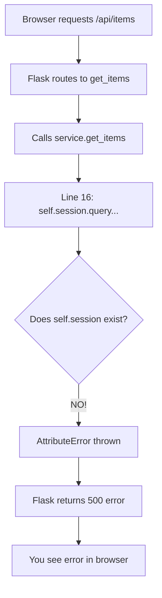

# API Endpoint Troubleshooting: Why http://localhost:5000/api/items Returns an Error

## Problem Statement

When you access `http://localhost:5000/api/items`, you receive an **AttributeError** instead of seeing the list of items.

**Error Message:**
```
AttributeError: 'InventoryService' object has no attribute 'session'
```

---

## Quick Diagnosis

I tested your API endpoint and confirmed it's **crashing with an AttributeError**. This means your Flask app is running, but the code has a bug that prevents it from working.

---

## Root Cause

### The Fatal Bug (Line 16 in inventory_service.py)

```python
# Line 9: Creates session but names it 'inventory'
self.inventory = SessionLocal()

# Line 16: Tries to use 'session' which doesn't exist!
return self.session.query(Product).all()  # ❌ CRASH!
```

**What happens when you call the API:**



---

## Current Code Analysis

### File: [inventory_service.py](file:///c:/Users/francis/OneDrive/Desktop/Templated/Inventory/services/inventory_service.py)

| Line | Code | Problem |
|------|------|---------|
| 9 | `self.inventory = SessionLocal()` | Creates session named **inventory** |
| 16 | `return self.session.query(Product).all()` | Tries to use **session** (doesn't exist!) |

### The Mismatch:

- **Defined:** `self.inventory`
- **Used:** `self.session`
- **Result:** AttributeError ❌

---

## Additional Critical Issues

### Issue 1: Incomplete SKU Column ([models.py:16](file:///c:/Users/francis/OneDrive/Desktop/Templated/Inventory/models.py#L16))

```python
sku = Column  # ❌ Missing type definition!
```

This will cause errors when creating Product objects.

### Issue 2: Wrong Operations Throughout Service

Your service treats the database session like a Python list:
- Line 12: `self.inventory.append(data)` ❌
- Line 19: Iterating over session ❌
- Line 30: List comprehension on session ❌

---

## The Complete Fix

### Step 1: Fix inventory_service.py

Replace the **entire file** with this corrected version:

```python
from database import SessionLocal
from models import Product


class InventoryService:
    def __init__(self):
        """Initialize service with database session."""
        self.session = SessionLocal()  # ✅ Correct name: session
        
    def add_item(self, data):
        """Add a new product to database."""
        try:
            product = Product(
                id=data.get('id'),
                name=data.get('name'),
                category=data.get('category'),
                quantity=data.get('quantity'),
                unit=data.get('unit'),
                expirationDate=data.get('expirationDate'),
                supplier=data.get('supplier'),
                price=data.get('price'),
                sku=data.get('sku')
            )
            self.session.add(product)
            self.session.commit()
            self.session.refresh(product)
            
            return {
                'message': 'Item added',
                'item': self._to_dict(product)
            }
        except Exception as e:
            self.session.rollback()
            return {'error': str(e)}
    
    def get_items(self):
        """Get all products from database."""
        try:
            products = self.session.query(Product).all()
            return [self._to_dict(p) for p in products]
        except Exception as e:
            return {'error': str(e)}
    
    def get_item(self, item_id):
        """Get single product by ID."""
        try:
            product = self.session.query(Product).filter(
                Product.id == item_id
            ).first()
            
            if product is None:
                return None
            
            return self._to_dict(product)
        except Exception as e:
            return {'error': str(e)}
    
    def update_item(self, item_id, data):
        """Update existing product."""
        try:
            product = self.session.query(Product).filter(
                Product.id == item_id
            ).first()
            
            if product is None:
                return {'message': 'Item not found'}
            
            for key, value in data.items():
                if hasattr(product, key) and key != 'id':
                    setattr(product, key, value)
            
            self.session.commit()
            
            return {
                'message': 'Item updated',
                'item': self._to_dict(product)
            }
        except Exception as e:
            self.session.rollback()
            return {'error': str(e)}
    
    def delete_item(self, item_id):
        """Delete product by ID."""
        try:
            product = self.session.query(Product).filter(
                Product.id == item_id
            ).first()
            
            if product is None:
                return {'message': 'Item not found'}
            
            self.session.delete(product)
            self.session.commit()
            
            return {'message': 'Item deleted'}
        except Exception as e:
            self.session.rollback()
            return {'error': str(e)}
    
    def _to_dict(self, product):
        """Convert Product object to dictionary."""
        return {
            'id': product.id,
            'name': product.name,
            'category': product.category,
            'quantity': product.quantity,
            'unit': product.unit,
            'expirationDate': product.expirationDate,
            'supplier': product.supplier,
            'price': product.price,
            'sku': product.sku
        }
    
    def __del__(self):
        """Cleanup session."""
        if hasattr(self, 'session'):
            self.session.close()
```

### Step 2: Fix models.py Line 16

```python
# Change line 16 from:
sku = Column

# To:
sku = Column(String)
```

### Step 3: Restart Flask Server

1. **Stop the server:** Press `Ctrl+C` in the terminal running `python app.py`
2. **Restart:** Run `python app.py` again

---

## Testing After Fix

### Test 1: Check Server Starts

```bash
python app.py
```

**Expected output:**
```
* Running on http://127.0.0.1:5000
```

### Test 2: Get All Items (Should Return Empty Array)

```bash
curl http://localhost:5000/api/items
```

**Expected:**
```json
[]
```

### Test 3: Add a Test Product

```bash
curl -X POST http://localhost:5000/api/items \
  -H "Content-Type: application/json" \
  -d "{\"id\":\"TEST001\",\"name\":\"Test Item\",\"category\":\"Electronics\",\"quantity\":10,\"unit\":1,\"expirationDate\":\"2025-12-31\",\"supplier\":\"ACME\",\"price\":99.99,\"sku\":\"SKU001\"}"
```

**Expected:**
```json
{
  "message": "Item added",
  "item": {
    "id": "TEST001",
    "name": "Test Item",
    ...
  }
}
```

### Test 4: Get Items Again (Should See Your Item)

```bash
curl http://localhost:5000/api/items
```

**Expected:**
```json
[
  {
    "id": "TEST001",
    "name": "Test Item",
    "category": "Electronics",
    ...
  }
]
```

---

## Why You're Seeing the Error in Browser

When you visit `http://localhost:5000/api/items` in your browser:

1. Flask receives the GET request
2. Routes it to `get_items()` function
3. Calls `service.get_items()`
4. **Crashes** on line 16: `self.session` doesn't exist
5. Flask catches the error and returns **500 Internal Server Error**
6. Your browser shows an error page

---

## Visual Summary

### Before Fix:
```
Browser → Flask → service.get_items() → Line 16 → ❌ AttributeError → 500 Error
```

### After Fix:
```
Browser → Flask → service.get_items() → Database Query → ✅ Return Items → 200 OK
```

---

## Summary of All Issues

| Issue | File | Line | Severity | Fix |
|-------|------|------|----------|-----|
| Wrong attribute name | inventory_service.py | 9, 16 | 🔴 Critical | Change `self.inventory` to `self.session` |
| Session as list | inventory_service.py | 12-31 | 🔴 Critical | Use SQLAlchemy query methods |
| Incomplete column | models.py | 16 | 🟡 High | Change `Column` to `Column(String)` |

> [!CAUTION]
> **Your API endpoint will continue to return errors until you fix inventory_service.py line 9.**

---

## Next Steps

1. ✅ **Apply the fix** to [inventory_service.py](file:///c:/Users/francis/OneDrive/Desktop/Templated/Inventory/services/inventory_service.py)
2. ✅ **Fix line 16** in [models.py](file:///c:/Users/francis/OneDrive/Desktop/Templated/Inventory/models.py#L16)
3. ✅ **Restart Flask server**
4. ✅ **Test the endpoint** with the commands above
5. ✅ **Verify it returns** `[]` (empty array, not an error)

After these fixes, your API will work correctly! 🎉
