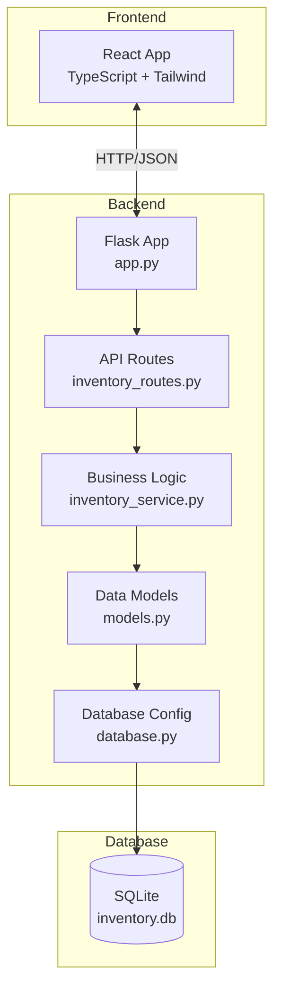

# Inventory Management System - Comprehensive Documentation

## Table of Contents
1. [System Overview](#system-overview)
2. [Architecture](#architecture)
3. [Database Design](#database-design)
4. [API Reference](#api-reference)
5. [Current Issues & Solutions](#current-issues--solutions)
6. [Setup & Configuration](#setup--configuration)
7. [Troubleshooting Guide](#troubleshooting-guide)

---

## System Overview

### Purpose
A full-stack inventory management system built with:
- **Backend:** Flask (Python) + SQLAlchemy ORM
- **Frontend:** React + TypeScript + Tailwind CSS
- **Database:** SQLite

### Key Features
- Product CRUD operations (Create, Read, Update, Delete)
- Real-time inventory tracking
- RESTful API design
- Cross-origin resource sharing (CORS) enabled for frontend integration

---

## Architecture

### System Architecture Diagram



### File Structure

```
Inventory/
├── app.py                      # Flask application entry point
├── database.py                 # SQLAlchemy configuration
├── models.py                   # Product data model
├── inventory.db                # SQLite database file
│
├── api/
│   ├── __init__.py
│   └── inventory_routes.py    # REST API endpoints
│
├── services/
│   ├── __init__.py
│   └── inventory_service.py   # Business logic layer
│
├── components/                 # React components
│   ├── Dashboard.tsx
│   ├── AddProductModal.tsx
│   └── ...
│
├── App.tsx                     # Main React component
├── main.tsx                    # React entry point
├── index.html                  # HTML template
├── vite.config.ts             # Vite configuration
└── tailwind.config.js         # Tailwind CSS config
```

---

## Database Design

### Product Model Schema

**Table Name:** `products`

| Column | Type | Constraints | Description |
|--------|------|-------------|-------------|
| `id` | String | PRIMARY KEY | Unique product identifier |
| `name` | String | - | Product name |
| `category` | String | - | Product category (e.g., Electronics, Food) |
| `quantity` | Integer | - | Current stock quantity |
| `unit` | Integer | - | Unit of measurement |
| `expirationDate` | String | - | Product expiration date (ISO format) |
| `supplier` | String | - | Supplier name |
| `price` | Float | - | Product price |
| `sku` | String | - | Stock Keeping Unit |

### Database Initialization

Tables are created automatically when Flask app starts via:

```python
# In models.py
Base.metadata.create_all(engine)
```

### Database Location

- **Relative path:** `./inventory.db`
- **Absolute path:** `c:\Users\francis\OneDrive\Desktop\Templated\Inventory\inventory.db`

---

## API Reference

### Base URL
```
http://localhost:5000/api/items
```

### Endpoints

#### 1. Get All Products

**Request:**
```http
GET /api/items
```

**Response (200 OK):**
```json
[
  {
    "id": "PROD001",
    "name": "Laptop",
    "category": "Electronics",
    "quantity": 50,
    "unit": 1,
    "expirationDate": "2025-12-31",
    "supplier": "Tech Supply Co.",
    "price": 999.99,
    "sku": "ELEC-LAP-001"
  }
]
```

**Response (Empty):**
```json
[]
```

---

#### 2. Get Single Product

**Request:**
```http
GET /api/items/{item_id}
```

**Example:**
```http
GET /api/items/PROD001
```

**Response (200 OK):**
```json
{
  "id": "PROD001",
  "name": "Laptop",
  "category": "Electronics",
  "quantity": 50,
  "unit": 1,
  "expirationDate": "2025-12-31",
  "supplier": "Tech Supply Co.",
  "price": 999.99,
  "sku": "ELEC-LAP-001"
}
```

**Response (404 Not Found):**
```json
{
  "error": "Item not found"
}
```

---

#### 3. Create Product

**Request:**
```http
POST /api/items
Content-Type: application/json
```

**Request Body:**
```json
{
  "id": "PROD002",
  "name": "Wireless Mouse",
  "category": "Electronics",
  "quantity": 100,
  "unit": 1,
  "expirationDate": "2026-06-30",
  "supplier": "Peripheral Plus",
  "price": 29.99,
  "sku": "ELEC-MOU-002"
}
```

**Response (201 Created):**
```json
{
  "message": "Item added",
  "item": {
    "id": "PROD002",
    "name": "Wireless Mouse",
    ...
  }
}
```

---

#### 4. Update Product

**Request:**
```http
PUT /api/items/{item_id}
Content-Type: application/json
```

**Request Body (Partial Update):**
```json
{
  "quantity": 75,
  "price": 27.99
}
```

**Response (200 OK):**
```json
{
  "message": "Item updated",
  "item": {
    "id": "PROD002",
    "quantity": 75,
    "price": 27.99,
    ...
  }
}
```

---

#### 5. Delete Product

**Request:**
```http
DELETE /api/items/{item_id}
```

**Response (200 OK):**
```json
{
  "message": "Item deleted"
}
```

**Response (404 Not Found):**
```json
{
  "message": "Item not found"
}
```

---

## Current Issues & Solutions

### Issue 1: AttributeError on Line 16 (CRITICAL)

**File:** [inventory_service.py](file:///c:/Users/francis/OneDrive/Desktop/Templated/Inventory/services/inventory_service.py)

**Problem:**
```python
# Line 9
self.inventory = SessionLocal()  # Creates session named 'inventory'

# Line 16
return self.session.query(Product).all()  # Uses 'session' - doesn't exist!
```

**Impact:** API endpoint `/api/items` returns 500 error

**Solution:**
```python
# Change line 9 to:
self.session = SessionLocal()
```

---

### Issue 2: Incomplete SKU Column Definition

**File:** [models.py:16](file:///c:/Users/francis/OneDrive/Desktop/Templated/Inventory/models.py#L16)

**Problem:**
```python
sku = Column  # Missing type and parentheses
```

**Impact:** Will cause errors when creating Product instances

**Solution:**
```python
sku = Column(String)
```

---

### Issue 3: Incorrect Session Operations

**File:** [inventory_service.py](file:///c:/Users/francis/OneDrive/Desktop/Templated/Inventory/services/inventory_service.py)

**Problem:** Code treats SQLAlchemy session as a Python list
- Line 12: `self.inventory.append(data)`
- Line 19-30: List operations on session object

**Impact:** Methods will crash with TypeError

**Solution:** Use proper SQLAlchemy ORM methods (see corrected code below)

---

## Setup & Configuration

### Prerequisites

```bash
# Python packages
pip install flask
pip install flask-cors
pip install sqlalchemy

# Node packages (for frontend)
npm install
```

### Environment Setup

1. **Database Configuration** ([database.py](file:///c:/Users/francis/OneDrive/Desktop/Templated/Inventory/database.py))
   ```python
   DATABASE_URL = 'sqlite:///inventory.db'
   engine = create_engine(DATABASE_URL, echo=True)
   ```

2. **Flask Configuration** ([app.py](file:///c:/Users/francis/OneDrive/Desktop/Templated/Inventory/app.py))
   - CORS enabled for React frontend
   - Debug mode enabled for development
   - Runs on `http://localhost:5000`

3. **React Configuration** ([vite.config.ts](file:///c:/Users/francis/OneDrive/Desktop/Templated/Inventory/vite.config.ts))
   - Development server on default port
   - Proxy API requests to Flask backend

### Running the Application

**Backend (Flask):**
```bash
cd c:\Users\francis\OneDrive\Desktop\Templated\Inventory
python app.py
```

**Frontend (React):**
```bash
cd c:\Users\francis\OneDrive\Desktop\Templated\Inventory
npm run dev
```

---

## Corrected Code Reference

### inventory_service.py (FIXED VERSION)

```python
from database import SessionLocal
from models import Product


class InventoryService:
    def __init__(self):
        """Initialize with database session."""
        self.session = SessionLocal()
        
    def add_item(self, data):
        """Add new product to database."""
        try:
            product = Product(
                id=data.get('id'),
                name=data.get('name'),
                category=data.get('category'),
                quantity=data.get('quantity'),
                unit=data.get('unit'),
                expirationDate=data.get('expirationDate'),
                supplier=data.get('supplier'),
                price=data.get('price'),
                sku=data.get('sku')
            )
            self.session.add(product)
            self.session.commit()
            self.session.refresh(product)
            
            return {
                'message': 'Item added',
                'item': self._to_dict(product)
            }
        except Exception as e:
            self.session.rollback()
            return {'error': str(e)}
    
    def get_items(self):
        """Retrieve all products."""
        try:
            products = self.session.query(Product).all()
            return [self._to_dict(p) for p in products]
        except Exception as e:
            return {'error': str(e)}
    
    def get_item(self, item_id):
        """Retrieve single product by ID."""
        try:
            product = self.session.query(Product).filter(
                Product.id == item_id
            ).first()
            
            return self._to_dict(product) if product else None
        except Exception as e:
            return {'error': str(e)}
    
    def update_item(self, item_id, data):
        """Update existing product."""
        try:
            product = self.session.query(Product).filter(
                Product.id == item_id
            ).first()
            
            if not product:
                return {'message': 'Item not found'}
            
            for key, value in data.items():
                if hasattr(product, key) and key != 'id':
                    setattr(product, key, value)
            
            self.session.commit()
            
            return {
                'message': 'Item updated',
                'item': self._to_dict(product)
            }
        except Exception as e:
            self.session.rollback()
            return {'error': str(e)}
    
    def delete_item(self, item_id):
        """Delete product by ID."""
        try:
            product = self.session.query(Product).filter(
                Product.id == item_id
            ).first()
            
            if not product:
                return {'message': 'Item not found'}
            
            self.session.delete(product)
            self.session.commit()
            
            return {'message': 'Item deleted'}
        except Exception as e:
            self.session.rollback()
            return {'error': str(e)}
    
    def _to_dict(self, product):
        """Convert Product to dictionary."""
        return {
            'id': product.id,
            'name': product.name,
            'category': product.category,
            'quantity': product.quantity,
            'unit': product.unit,
            'expirationDate': product.expirationDate,
            'supplier': product.supplier,
            'price': product.price,
            'sku': product.sku
        }
    
    def __del__(self):
        """Cleanup session."""
        if hasattr(self, 'session'):
            self.session.close()
```

---

## Troubleshooting Guide

### Problem: API Returns 500 Error

**Symptoms:**
- Browser shows error when accessing `/api/items`
- Terminal shows `AttributeError`

**Solution:**
1. Check [inventory_service.py:16](file:///c:/Users/francis/OneDrive/Desktop/Templated/Inventory/services/inventory_service.py#L16)
2. Verify `self.session` is used consistently
3. Replace with corrected code above

---

### Problem: Database Table Not Found

**Symptoms:**
- `sqlite3.OperationalError: no such table: products`

**Solution:**
1. Check that [models.py:18](file:///c:/Users/francis/OneDrive/Desktop/Templated/Inventory/models.py#L18) has:
   ```python
   Base.metadata.create_all(engine)
   ```
2. Delete `inventory.db` and restart Flask

---

### Problem: Product Creation Fails

**Symptoms:**
- POST request to `/api/items` returns error
- Error mentions `sku` column

**Solution:**
Fix [models.py:16](file:///c:/Users/francis/OneDrive/Desktop/Templated/Inventory/models.py#L16):
```python
sku = Column(String)  # Add (String)
```

---

### Problem: CORS Error in Frontend

**Symptoms:**
- Browser console shows CORS policy error
- Frontend can't access API

**Solution:**
Verify [app.py](file:///c:/Users/francis/OneDrive/Desktop/Templated/Inventory/app.py) has:
```python
from flask_cors import CORS
CORS(app)
```

---

## Best Practices

### Error Handling
- All service methods include try/except blocks
- Database rollback on errors
- Meaningful error messages returned

### Session Management
- Session created per service instance
- Session closed in `__del__` method
- Commit after each write operation

### API Design
- RESTful conventions followed
- Proper HTTP status codes
- JSON responses for all endpoints

### Data Validation
- ID uniqueness enforced by PRIMARY KEY
- Type checking via SQLAlchemy Column types
- Frontend validation (recommended)

---

## Security Considerations

> [!WARNING]
> **Development Mode Only**
> - Debug mode is ON (`app.run(debug=True)`)
> - CORS allows all origins
> - No authentication implemented
> - Not production-ready

### For Production:
1. Disable debug mode
2. Configure specific CORS origins
3. Add authentication (JWT, OAuth)
4. Use environment variables for config
5. Switch to PostgreSQL/MySQL
6. Add input validation and sanitization

---

## Performance Optimization Tips

1. **Database Indexing:** Add indexes on frequently queried columns
2. **Connection Pooling:** Configure SQLAlchemy pool settings
3. **Caching:** Implement Redis for frequently accessed data
4. **Pagination:** Add limit/offset to GET /api/items
5. **Batch Operations:** Support bulk create/update/delete

---

## Summary

This inventory system provides a solid foundation for product management with:
- ✅ Clean architecture separating concerns
- ✅ RESTful API design
- ✅ ORM-based database access
- ⚠️ Critical bugs requiring fixes (documented above)
- ⚠️ Development configuration (not production-ready)

Apply the fixes in the "Current Issues & Solutions" section to make the system fully functional.
