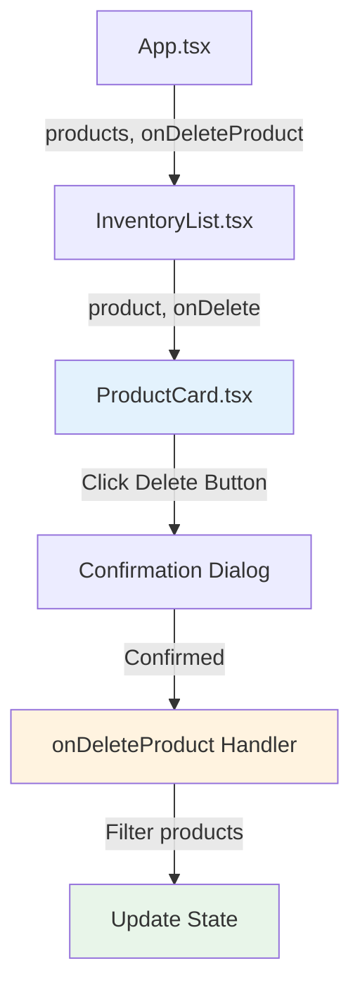
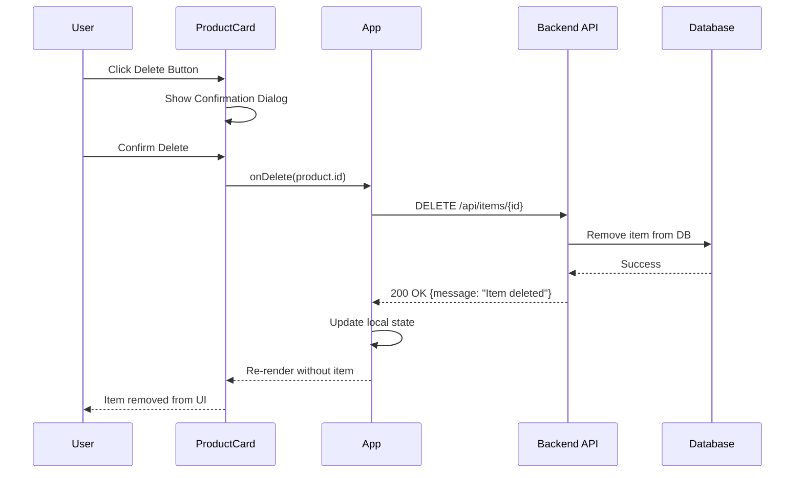

# InventoryList Delete Functionality Documentation

## Overview

This document explains how the delete functionality works in your `InventoryList` component, including the complete data flow from the UI to the backend API.

---

## Component Architecture



---

## How Delete Currently Works

### 1. Component Structure

#### **App.tsx** (Parent Component)
- **Location:** [App.tsx](file:///c:/Users/francis/OneDrive/Desktop/Templated/Inventory/App.tsx)
- **Manages:** Global product state
- **Delete Handler:** `handleDeleteProduct` function

```typescript
const handleDeleteProduct = (id: string) => {
  setProducts(products.filter(p => p.id !== id));
};
```

**What it does:**
- Receives the product `id` to delete
- Filters out the product with matching `id` from the products array
- Updates the state with the new filtered array

#### **InventoryList.tsx** (Container Component)
- **Location:** [InventoryList.tsx](file:///c:/Users/francis/OneDrive/Desktop/Templated/Inventory/components/InventoryList.tsx#L12)
- **Receives:** `onDeleteProduct` function as a prop
- **Passes down:** The delete handler to `ProductCard` components

```typescript
export function InventoryList({ products, onDeleteProduct, onUpdateProduct }: InventoryListProps) {
  // ... filtering logic
  
  return (
    <div className="grid grid-cols-1 lg:grid-cols-2 gap-6">
      {filteredProducts.map(product => (
        <ProductCard
          key={product.id}
          product={product}
          onDelete={onDeleteProduct}  // Passes the handler down
          onUpdate={onUpdateProduct}
        />
      ))}
    </div>
  );
}
```

**What it does:**
- Receives `onDeleteProduct` from parent (`App.tsx`)
- Passes it down to each `ProductCard` as the `onDelete` prop
- Acts as a pass-through component for the delete function

#### **ProductCard.tsx** (Presentation Component)
- **Location:** [ProductCard.tsx](file:///c:/Users/francis/OneDrive/Desktop/Templated/Inventory/components/ProductCard.tsx#L40-L50)
- **Implements:** Delete button with confirmation dialog
- **Calls:** The `onDelete` handler when confirmed

```typescript
<button
  onClick={() => {
    if (confirm(`Are you sure you want to delete ${product.name}?`)) {
      onDelete(product.id);
    }
  }}
  className="p-2 text-red-600 hover:bg-red-50 rounded-lg transition-colors"
  title="Delete"
>
  <Trash2 className="h-4 w-4" />
</button>
```

**What it does:**
1. Shows a confirmation dialog when delete button is clicked
2. If user confirms, calls `onDelete(product.id)`
3. The ID bubbles up through the component hierarchy
4. Eventually triggers the state update in `App.tsx`

---

## Current Limitation: No API Integration

> [!WARNING]
> **Important:** The current delete implementation only updates the local state in the browser. It does **NOT** call the backend API to delete the item from the database.

### Current Flow
```
User clicks Delete → Confirmation → Local state update (filtered array)
```

### What's Missing
```
User clicks Delete → Confirmation → API call to backend → Local state update
```

**Problem:** When you refresh the page, the "deleted" items will reappear because they were never actually deleted from the backend.

---

## How to Add API Integration

To properly delete items, you need to integrate with your Flask backend API that we documented earlier.

### Step 1: Update the Delete Handler in App.tsx

Replace the current `handleDeleteProduct` function with one that calls the API:

```typescript
const handleDeleteProduct = async (id: string) => {
  try {
    // Call the DELETE API endpoint
    const response = await fetch(`http://localhost:5000/api/items/${id}`, {
      method: 'DELETE',
      headers: {
        'Content-Type': 'application/json'
      }
    });

    if (response.ok) {
      // Only update local state if API call was successful
      setProducts(products.filter(p => p.id !== id));
      console.log('Item deleted successfully');
    } else {
      console.error('Failed to delete item:', response.status);
      alert('Failed to delete item. Please try again.');
    }
  } catch (error) {
    console.error('Error deleting item:', error);
    alert('Network error. Please check your connection.');
  }
};
```

### Step 2: Add Loading State (Optional but Recommended)

For better user experience, add a loading indicator:

```typescript
const [deletingId, setDeletingId] = useState<string | null>(null);

const handleDeleteProduct = async (id: string) => {
  setDeletingId(id); // Show loading state
  
  try {
    const response = await fetch(`http://localhost:5000/api/items/${id}`, {
      method: 'DELETE',
      headers: {
        'Content-Type': 'application/json'
      }
    });

    if (response.ok) {
      setProducts(products.filter(p => p.id !== id));
      console.log('Item deleted successfully');
    } else {
      console.error('Failed to delete item:', response.status);
      alert('Failed to delete item. Please try again.');
    }
  } catch (error) {
    console.error('Error deleting item:', error);
    alert('Network error. Please check your connection.');
  } finally {
    setDeletingId(null); // Clear loading state
  }
};
```

Then pass the `deletingId` to components for visual feedback.

---

## Complete Enhanced Implementation

### Updated App.tsx

Here's the complete updated code for [App.tsx](file:///c:/Users/francis/OneDrive/Desktop/Templated/Inventory/App.tsx#L81-L83):

```typescript
const API_BASE_URL = 'http://localhost:5000/api';

export default function App() {
  const [products, setProducts] = useState<Product[]>(initialProducts);
  const [currentView, setCurrentView] = useState<'dashboard' | 'inventory' | 'purchase-orders' | 'damaged-returns' | 'settings'>('dashboard');
  const [isAddModalOpen, setIsAddModalOpen] = useState(false);
  const [deletingId, setDeletingId] = useState<string | null>(null);

  // Load products from Flask backend API
  useEffect(() => {
    fetch(`${API_BASE_URL}/items`)
      .then(res => res.json())
      .then(data => setProducts(data))
      .catch(err => console.error('Error loading products:', err));
  }, []);

  const handleAddProduct = (product: Omit<Product, 'id'>) => {
    const newProduct: Product = {
      ...product,
      id: Date.now().toString()
    };
    setProducts([...products, newProduct]);
    setIsAddModalOpen(false);
  };

  const handleDeleteProduct = async (id: string) => {
    // Prevent multiple deletes at once
    if (deletingId) return;
    
    setDeletingId(id);
    
    try {
      const response = await fetch(`${API_BASE_URL}/items/${id}`, {
        method: 'DELETE',
        headers: {
          'Content-Type': 'application/json'
        }
      });

      if (response.ok) {
        // Successfully deleted from backend, update local state
        setProducts(products.filter(p => p.id !== id));
        console.log('Item deleted successfully');
      } else {
        const errorData = await response.json().catch(() => ({}));
        console.error('Failed to delete item:', response.status, errorData);
        alert(`Failed to delete item: ${errorData.error || 'Unknown error'}`);
      }
    } catch (error) {
      console.error('Error deleting item:', error);
      alert('Network error. Please check your connection and try again.');
    } finally {
      setDeletingId(null);
    }
  };

  const handleUpdateProduct = (updatedProduct: Product) => {
    setProducts(products.map(p => p.id === updatedProduct.id ? updatedProduct : p));
  };

  return (
    <div className="min-h-screen bg-gray-50">
      <Navbar
        currentView={currentView}
        onViewChange={setCurrentView}
        onAddProduct={() => setIsAddModalOpen(true)}
      />

      <main className="max-w-7xl mx-auto px-4 sm:px-6 lg:px-8 py-8">
        {currentView === 'dashboard' ? (
          <Dashboard products={products} />
        ) : currentView === 'inventory' ? (
          <InventoryList
            products={products}
            onDeleteProduct={handleDeleteProduct}
            onUpdateProduct={handleUpdateProduct}
          />
        ) : currentView === 'purchase-orders' ? (
          <PurchaseOrders products={products} />
        ) : currentView === 'damaged-returns' ? (
          <DamagedReturns products={products} />
        ) : (
          <Settings />
        )}
      </main>

      {isAddModalOpen && (
        <AddProductModal
          onClose={() => setIsAddModalOpen(false)}
          onAdd={handleAddProduct}
        />
      )}
    </div>
  );
}
```

### Enhanced ProductCard with Loading State

Update [ProductCard.tsx](file:///c:/Users/francis/OneDrive/Desktop/Templated/Inventory/components/ProductCard.tsx#L6-L10) to accept and display loading state:

```typescript
interface ProductCardProps {
  product: Product;
  onDelete: (id: string) => void;
  onUpdate: (product: Product) => void;
  isDeleting?: boolean; // Optional loading state
}

export function ProductCard({ product, onDelete, onUpdate, isDeleting = false }: ProductCardProps) {
  const [isEditModalOpen, setIsEditModalOpen] = useState(false);
  
  // ... rest of component
  
  return (
    <>
      <div className={`bg-white rounded-xl p-6 shadow-sm border border-gray-200 hover:shadow-md transition-shadow ${isDeleting ? 'opacity-50 pointer-events-none' : ''}`}>
        {/* Header */}
        <div className="flex items-start justify-between mb-4">
          <div className="flex-1">
            <h3 className="text-gray-900 mb-1">{product.name}</h3>
            <p className="text-sm text-gray-500">SKU: {product.sku}</p>
          </div>
          <div className="flex items-center gap-2">
            <button
              onClick={() => setIsEditModalOpen(true)}
              disabled={isDeleting}
              className="p-2 text-gray-600 hover:bg-gray-100 rounded-lg transition-colors disabled:opacity-50"
              title="Edit"
            >
              <Edit2 className="h-4 w-4" />
            </button>
            <button
              onClick={() => {
                if (confirm(`Are you sure you want to delete ${product.name}?`)) {
                  onDelete(product.id);
                }
              }}
              disabled={isDeleting}
              className="p-2 text-red-600 hover:bg-red-50 rounded-lg transition-colors disabled:opacity-50 disabled:cursor-not-allowed"
              title={isDeleting ? "Deleting..." : "Delete"}
            >
              {isDeleting ? (
                <div className="h-4 w-4 border-2 border-red-600 border-t-transparent rounded-full animate-spin" />
              ) : (
                <Trash2 className="h-4 w-4" />
              )}
            </button>
          </div>
        </div>
        
        {/* Rest of the card content */}
        {/* ... */}
      </div>
      
      {/* Modal */}
      {isEditModalOpen && (
        <EditProductModal
          product={product}
          onClose={() => setIsEditModalOpen(false)}
          onUpdate={onUpdate}
        />
      )}
    </>
  );
}
```

### Updated InventoryList to Pass Loading State

Update [InventoryList.tsx](file:///c:/Users/francis/OneDrive/Desktop/Templated/Inventory/components/InventoryList.tsx#L6-L10):

```typescript
interface InventoryListProps {
  products: Product[];
  onDeleteProduct: (id: string) => void;
  onUpdateProduct: (product: Product) => void;
  deletingId?: string | null; // Optional: ID of item being deleted
}

export function InventoryList({ 
  products, 
  onDeleteProduct, 
  onUpdateProduct,
  deletingId = null 
}: InventoryListProps) {
  const [searchTerm, setSearchTerm] = useState('');
  const [selectedCategory, setSelectedCategory] = useState('all');

  // ... filtering logic

  return (
    <div className="space-y-6">
      {/* ... filters and header */}
      
      <div className="grid grid-cols-1 lg:grid-cols-2 gap-6">
        {filteredProducts.map(product => (
          <ProductCard
            key={product.id}
            product={product}
            onDelete={onDeleteProduct}
            onUpdate={onUpdateProduct}
            isDeleting={deletingId === product.id}
          />
        ))}
      </div>
    </div>
  );
}
```

---

## Data Flow Diagram

### Complete Delete Flow with API Integration



---

## Testing the Delete Functionality

### 1. Manual Testing Steps

1. **Start your Flask backend:**
   ```bash
   python app.py
   ```

2. **Start your React frontend:**
   ```bash
   npm run dev
   ```

3. **Open the application** in your browser

4. **Navigate to Inventory view**

5. **Click the delete (trash) icon** on any product card

6. **Confirm the deletion** in the dialog

7. **Verify:**
   - Item disappears from the UI immediately
   - Check browser console for success message
   - Refresh the page - item should still be gone

### 2. Console Testing

Open browser DevTools and monitor the Network tab:

```
DELETE http://localhost:5000/api/items/1
Status: 200
Response: {"message": "Item deleted"}
```

### 3. Backend Verification

Check your Flask terminal for the DELETE request log:
```
DELETE /api/items/1 - 200 OK
```

---

## Error Scenarios and Handling

### Scenario 1: Backend Server is Down

**What happens:**
- Network error caught in try-catch
- Alert shown to user
- Item remains in UI (not deleted locally)

**User Experience:**
```
Alert: "Network error. Please check your connection and try again."
```

### Scenario 2: Item Not Found (404)

**What happens:**
- Backend returns 404 (if you implement proper error codes)
- Error alert shown
- Item removed from local state anyway (optimistic update could be added)

**Recommended handling:**
```typescript
if (response.status === 404) {
  // Item already deleted, just update local state
  setProducts(products.filter(p => p.id !== id));
} else if (!response.ok) {
  // Other error
  alert('Failed to delete item');
}
```

### Scenario 3: Permission Denied (403)

**What happens:**
- Backend returns 403 Forbidden
- Alert shown with error message
- Item remains in UI

---

## Additional Enhancements

### 1. Toast Notifications Instead of Alerts

Replace `alert()` with a toast library like `react-hot-toast`:

```bash
npm install react-hot-toast
```

```typescript
import toast from 'react-hot-toast';

const handleDeleteProduct = async (id: string) => {
  const loadingToast = toast.loading('Deleting item...');
  
  try {
    const response = await fetch(`${API_BASE_URL}/items/${id}`, {
      method: 'DELETE',
      headers: { 'Content-Type': 'application/json' }
    });

    if (response.ok) {
      setProducts(products.filter(p => p.id !== id));
      toast.success('Item deleted successfully!', { id: loadingToast });
    } else {
      toast.error('Failed to delete item', { id: loadingToast });
    }
  } catch (error) {
    toast.error('Network error occurred', { id: loadingToast });
  }
};
```

### 2. Optimistic Updates

Update UI immediately, then rollback if API fails:

```typescript
const handleDeleteProduct = async (id: string) => {
  // Save current state for rollback
  const originalProducts = products;
  
  // Optimistically update UI
  setProducts(products.filter(p => p.id !== id));
  
  try {
    const response = await fetch(`${API_BASE_URL}/items/${id}`, {
      method: 'DELETE',
      headers: { 'Content-Type': 'application/json' }
    });

    if (!response.ok) {
      // Rollback on error
      setProducts(originalProducts);
      toast.error('Failed to delete item');
    }
  } catch (error) {
    // Rollback on network error
    setProducts(originalProducts);
    toast.error('Network error occurred');
  }
};
```

### 3. Undo Functionality

Allow users to undo deletions:

```typescript
const handleDeleteProduct = async (id: string) => {
  const deletedProduct = products.find(p => p.id === id);
  setProducts(products.filter(p => p.id !== id));
  
  const undoToast = toast((t) => (
    <span>
      Item deleted
      <button
        onClick={() => {
          setProducts([...products, deletedProduct!]);
          toast.dismiss(t.id);
        }}
        className="ml-2 text-blue-600"
      >
        Undo
      </button>
    </span>
  ), { duration: 5000 });
  
  // Wait for undo timeout, then call API
  setTimeout(async () => {
    try {
      await fetch(`${API_BASE_URL}/items/${id}`, {
        method: 'DELETE',
        headers: { 'Content-Type': 'application/json' }
      });
    } catch (error) {
      console.error('Failed to delete from backend:', error);
    }
  }, 5000);
};
```

---

## Backend API Endpoint

Make sure your Flask backend has the DELETE endpoint configured. Current implementation from [inventory_routes.py](file:///c:/Users/francis/OneDrive/Desktop/Templated/Inventory/api/inventory_routes.py#L29-L32):

```python
@inventory_bp.route("/<item_id>", methods=['DELETE'])
def delete_item(item_id):
    service.delete_item(item_id)
    return jsonify({'message': 'Item deleted'}), 200
```

> [!IMPORTANT]
> Ensure your Flask app is running and the route is registered with the `/api` prefix:
> ```python
> app.register_blueprint(inventory_bp, url_prefix='/api/items')
> ```

---

## Summary

### Current Implementation
✅ Delete button in ProductCard  
✅ Confirmation dialog  
✅ Local state update  
❌ No API integration  

### Recommended Implementation
✅ Delete button in ProductCard  
✅ Confirmation dialog  
✅ API call to backend  
✅ Local state update  
✅ Error handling  
✅ Loading states  
✅ User feedback (toasts)  

### Key Files to Modify
1. [App.tsx](file:///c:/Users/francis/OneDrive/Desktop/Templated/Inventory/App.tsx#L81-L83) - Add async API call
2. [ProductCard.tsx](file:///c:/Users/francis/OneDrive/Desktop/Templated/Inventory/components/ProductCard.tsx#L40-L50) - Add loading state
3. [InventoryList.tsx](file:///c:/Users/francis/OneDrive/Desktop/Templated/Inventory/components/InventoryList.tsx) - Pass deletingId prop

---

## Related Documentation

- [Delete Item API Documentation](file:///c:/Users/francis/OneDrive/Desktop/Templated/Inventory/Documentation/delete_item_api_documentation.md) - Backend API details
- [UI Frontend Documentation](file:///c:/Users/francis/OneDrive/Desktop/Templated/Inventory/Documentation/ui_frontend_documentation.md) - General frontend architecture
- [Update Item Documentation](file:///c:/Users/francis/OneDrive/Desktop/Templated/Inventory/Documentation/update_item_method_documentation.md) - Similar pattern for updates

---

**Last Updated:** 2025-11-29  
**Version:** 1.0
