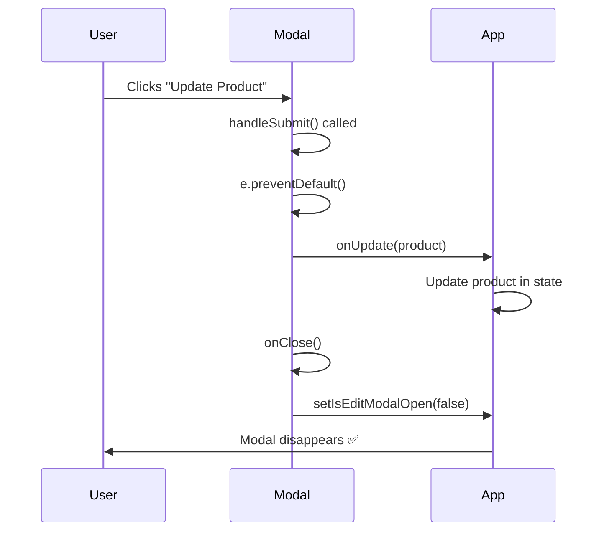
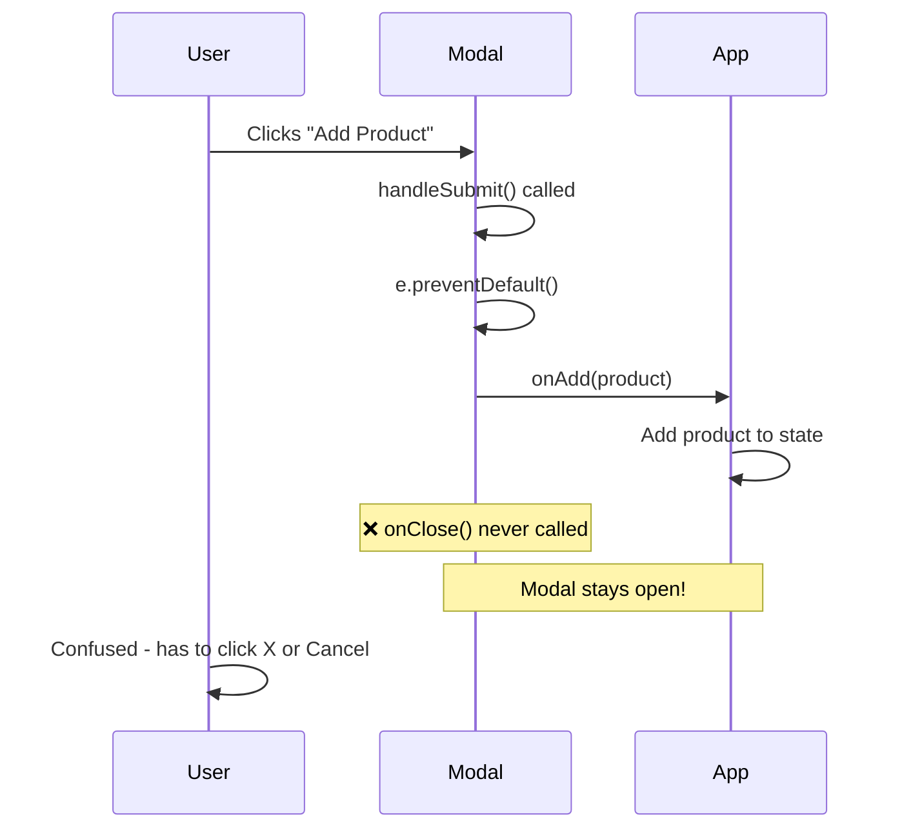
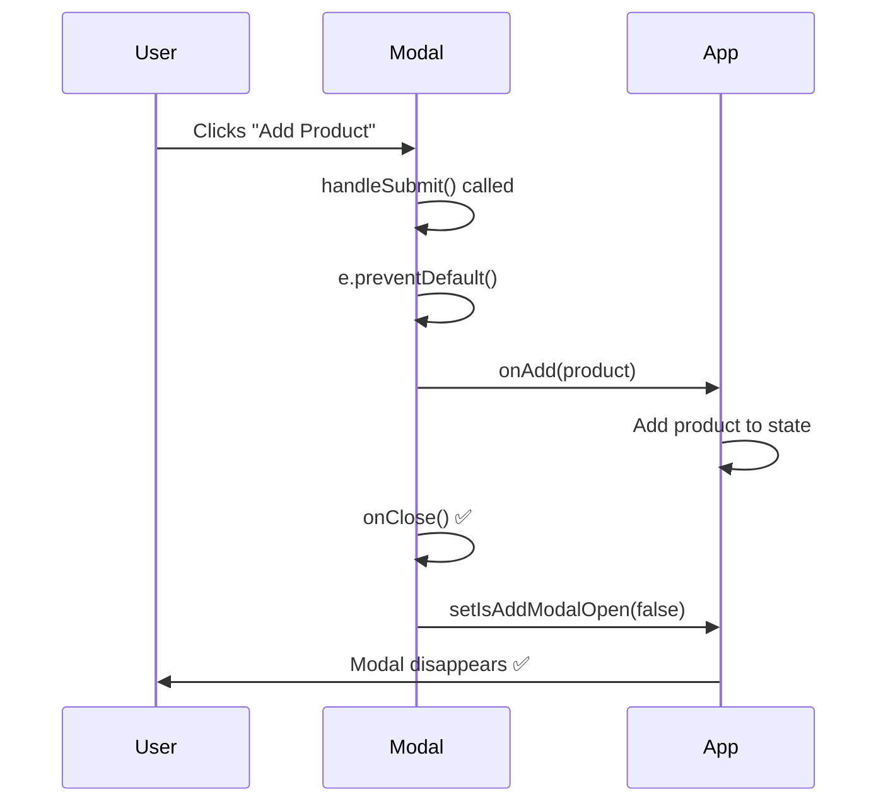

# EditProductModal Issue Documentation

## Problem Statement

The **EditProductModal** appears to work correctly, but the **AddProductModal has a critical bug** that prevents it from closing properly after adding a product. This creates an inconsistent user experience.

---

## Quick Diagnosis

### ✅ EditProductModal (WORKING)
```typescript
const handleSubmit = (e: React.FormEvent) => {
  e.preventDefault();
  onUpdate({ /* product data */ });
  onClose();  // ✅ CLOSES MODAL
};
```

### ❌ AddProductModal (BROKEN)
```typescript
const handleSubmit = (e: React.FormEvent) => {
  e.preventDefault();
  onAdd({ /* product data */ });
  // ❌ MISSING: onClose() call
};
```

---

## Root Cause Analysis

### Issue Location

**File:** [AddProductModal.tsx](file:///c:/Users/francis/OneDrive/Desktop/Templated/Inventory/components/AddProductModal.tsx)  
**Line:** 37-51 (`handleSubmit` function)

### The Bug

The `AddProductModal` is missing the `onClose()` call after successfully adding a product.

**Current Code (Lines 37-51):**
```typescript
const handleSubmit = (e: React.FormEvent) => {
  e.preventDefault();
  onAdd({
    name: formData.name,
    category: formData.category,
    quantity: Number(formData.quantity),
    unit: formData.unit,
    reorderLevel: Number(formData.reorderLevel),
    expirationDate: formData.expirationDate,
    batchNumber: formData.batchNumber,
    supplier: formData.supplier,
    price: Number(formData.price),
    sku: formData.sku
  });
  // ❌ Modal stays open because onClose() is never called!
};
```

---

## Side-by-Side Comparison

### EditProductModal (Correct) ✅

```typescript
// Lines 38-54
const handleSubmit = (e: React.FormEvent) => {
  e.preventDefault();
  
  // Update the product
  onUpdate({
    ...product,
    name: formData.name,
    category: formData.category,
    quantity: Number(formData.quantity),
    unit: formData.unit,
    reorderLevel: Number(formData.reorderLevel),
    expirationDate: formData.expirationDate,
    batchNumber: formData.batchNumber,
    supplier: formData.supplier,
    price: Number(formData.price),
    sku: formData.sku
  });
  
  onClose();  // ✅ Closes modal after update
};
```

### AddProductModal (Broken) ❌

```typescript
// Lines 37-51
const handleSubmit = (e: React.FormEvent) => {
  e.preventDefault();
  
  // Add the product
  onAdd({
    name: formData.name,
    category: formData.category,
    quantity: Number(formData.quantity),
    unit: formData.unit,
    reorderLevel: Number(formData.reorderLevel),
    expirationDate: formData.expirationDate,
    batchNumber: formData.batchNumber,
    supplier: formData.supplier,
    price: Number(formData.price),
    sku: formData.sku
  });
  
  // ❌ Missing onClose() - modal stays open!
};
```

---

## Visual Flow Diagrams

### Expected Behavior (EditProductModal)



### Actual Behavior (AddProductModal - BROKEN)



### Expected Behavior (AddProductModal - FIXED)



---

## Impact on User Experience

### Current Broken Experience

1. User clicks "Add Product" button
2. Modal opens with empty form
3. User fills in product details
4. User clicks "Add Product" submit button
5. **Product is added BUT modal stays open** ❌
6. Form still shows the data user just entered
7. User must manually click "Cancel" or "X" to close
8. Confusing - did it save or not?

### Expected Fixed Experience

1. User clicks "Add Product" button
2. Modal opens with empty form
3. User fills in product details
4. User clicks "Add Product" submit button
5. **Product is added AND modal closes** ✅
6. User sees new product in inventory list
7. Clear confirmation that action succeeded

---

## Why This Matters

### User Confusion
- Modal staying open suggests the action didn't complete
- Users might click "Add Product" again, creating duplicates
- Inconsistent with EditProductModal behavior

### Developer Expectations
- Standard modal pattern: close after successful action
- Form submission should provide clear feedback
- Modals should only stay open on errors (not implemented yet)

---

## The Fix

### Simple One-Line Fix

**File:** [AddProductModal.tsx](file:///c:/Users/francis/OneDrive/Desktop/Templated/Inventory/components/AddProductModal.tsx)  
**Line:** After line 50

```diff
  const handleSubmit = (e: React.FormEvent) => {
    e.preventDefault();
    onAdd({
      name: formData.name,
      category: formData.category,
      quantity: Number(formData.quantity),
      unit: formData.unit,
      reorderLevel: Number(formData.reorderLevel),
      expirationDate: formData.expirationDate,
      batchNumber: formData.batchNumber,
      supplier: formData.supplier,
      price: Number(formData.price),
      sku: formData.sku
    });
+   onClose();  // Add this line!
  };
```

### Complete Corrected Function

```typescript
const handleSubmit = (e: React.FormEvent) => {
  e.preventDefault();
  
  onAdd({
    name: formData.name,
    category: formData.category,
    quantity: Number(formData.quantity),
    unit: formData.unit,
    reorderLevel: Number(formData.reorderLevel),
    expirationDate: formData.expirationDate,
    batchNumber: formData.batchNumber,
    supplier: formData.supplier,
    price: Number(formData.price),
    sku: formData.sku
  });
  
  onClose();  // ✅ Close modal after adding
};
```

---

## Additional Improvements (Optional)

### Enhancement 1: Reset Form After Close

Currently, if user opens modal again after adding a product, the form still has the old data. Better to reset it:

```typescript
const handleSubmit = (e: React.FormEvent) => {
  e.preventDefault();
  
  onAdd({
    name: formData.name,
    category: formData.category,
    quantity: Number(formData.quantity),
    unit: formData.unit,
    reorderLevel: Number(formData.reorderLevel),
    expirationDate: formData.expirationDate,
    batchNumber: formData.batchNumber,
    supplier: formData.supplier,
    price: Number(formData.price),
    sku: formData.sku
  });
  
  // Reset form to initial state
  setFormData({
    name: '',
    category: 'Vitamins',
    quantity: '',
    unit: 'bottles',
    reorderLevel: '',
    expirationDate: '',
    batchNumber: '',
    supplier: '',
    price: '',
    sku: ''
  });
  
  onClose();
};
```

### Enhancement 2: Success Notification

Add visual feedback that product was added:

```typescript
const handleSubmit = (e: React.FormEvent) => {
  e.preventDefault();
  
  const newProduct = {
    name: formData.name,
    category: formData.category,
    quantity: Number(formData.quantity),
    unit: formData.unit,
    reorderLevel: Number(formData.reorderLevel),
    expirationDate: formData.expirationDate,
    batchNumber: formData.batchNumber,
    supplier: formData.supplier,
    price: Number(formData.price),
    sku: formData.sku
  };
  
  onAdd(newProduct);
  
  // Show success notification (if you have a notification system)
  // toast.success(`${newProduct.name} added successfully!`);
  
  onClose();
};
```

### Enhancement 3: Error Handling

Handle errors gracefully:

```typescript
const handleSubmit = async (e: React.FormEvent) => {
  e.preventDefault();
  
  try {
    const newProduct = {
      name: formData.name,
      category: formData.category,
      quantity: Number(formData.quantity),
      unit: formData.unit,
      reorderLevel: Number(formData.reorderLevel),
      expirationDate: formData.expirationDate,
      batchNumber: formData.batchNumber,
      supplier: formData.supplier,
      price: Number(formData.price),
      sku: formData.sku
    };
    
    await onAdd(newProduct);  // If onAdd is async
    
    // Success - close modal
    onClose();
    
  } catch (error) {
    // Error - keep modal open and show error
    alert(`Failed to add product: ${error.message}`);
    // OR use a proper error state
  }
};
```

---

## Testing the Fix

### Before Fix
```
1. Click "Add Product"
2. Fill form
3. Click "Add Product" button
4. ❌ Modal stays open
5. Must click Cancel/X manually
```

### After Fix
```
1. Click "Add Product"
2. Fill form
3. Click "Add Product" button
4. ✅ Modal closes automatically
5. See new product in list
```

---

## Code Diff Summary

**File to Edit:** `components/AddProductModal.tsx`

**Change Required:**

```diff
@@ -47,6 +47,7 @@
       supplier: formData.supplier,
       price: Number(formData.price),
       sku: formData.sku
     });
+    onClose();
   };
```

**Lines Changed:** 1 line added (after line 50)

---

## Why EditProductModal Works

The EditProductModal **already has** the `onClose()` call:

**Location:** [EditProductModal.tsx:53](file:///c:/Users/francis/OneDrive/Desktop/Templated/Inventory/components/EditProductModal.tsx#L53)

```typescript
const handleSubmit = (e: React.FormEvent) => {
  e.preventDefault();
  onUpdate({
    ...product,
    name: formData.name,
    category: formData.category,
    quantity: Number(formData.quantity),
    unit: formData.unit,
    reorderLevel: Number(formData.reorderLevel),
    expirationDate: formData.expirationDate,
    batchNumber: formData.batchNumber,
    supplier: formData.supplier,
    price: Number(formData.price),
    sku: formData.sku
  });
  onClose();  // ✅ This line is present in EditProductModal
};
```

This is why editing works perfectly - it was implemented correctly from the start!

---

## Component Comparison Table

| Feature | AddProductModal | EditProductModal |
|---------|----------------|------------------|
| **Props** | `onClose`, `onAdd` | `onClose`, `onUpdate`, `product` |
| **Form Pre-fill** | Empty | Pre-filled with product data |
| **Submit Handler** | `onAdd()` | `onUpdate()` |
| **onClose() call** | ❌ **Missing** | ✅ **Present** |
| **Works Correctly** | ❌ **No** | ✅ **Yes** |

---

## Summary

### The Problem
- **AddProductModal** is missing `onClose()` call in `handleSubmit`
- Modal stays open after adding product
- User must manually close it
- Inconsistent with EditProductModal behavior

### The Solution
- Add **one line**: `onClose();` after `onAdd()` call
- This makes both modals behave consistently
- Improves user experience significantly

### Files to Modify
1. **[AddProductModal.tsx](file:///c:/Users/francis/OneDrive/Desktop/Templated/Inventory/components/AddProductModal.tsx)** - Add `onClose()` on line 51

### Additional Recommendations
- Consider adding form reset
- Add success notification
- Implement error handling
- Match EditProductModal's complete pattern

---

**Apply the one-line fix and your modal will work perfectly!** ✅
