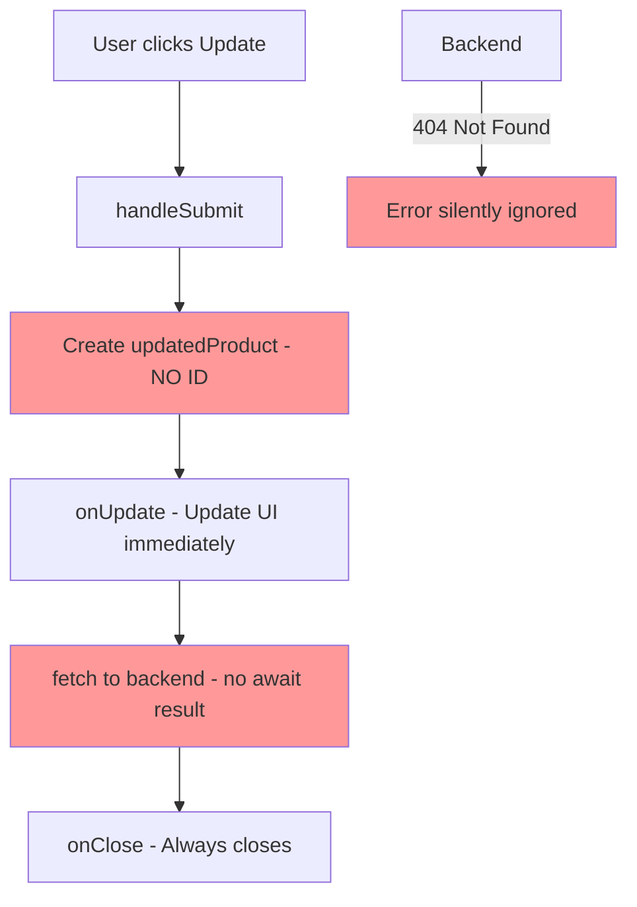
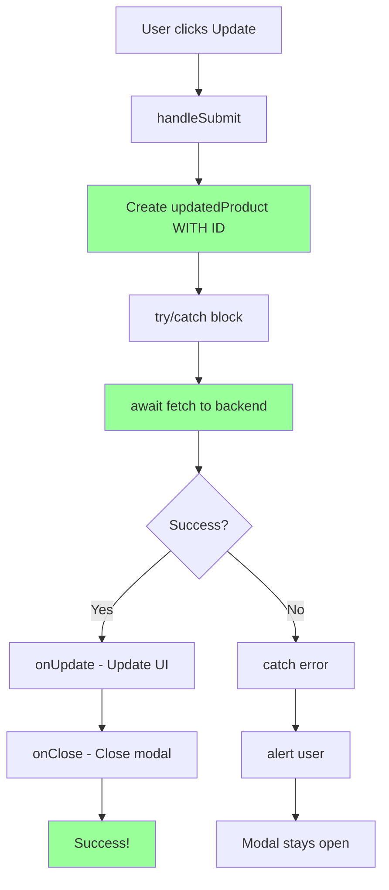

# EditProductModal.tsx Issues Documentation

## Critical Issues Found

I've identified **5 critical problems** in your EditProductModal implementation that will prevent updates from working correctly.

---

## Issue 1: Missing Product ID ❌ (CRITICAL)

### Location
[EditProductModal.tsx:40-52](file:///c:/Users/francis/OneDrive/Desktop/Templated/Inventory/components/EditProductModal.tsx#L40-L52)

### The Problem

```typescript
const updatedProduct = {
  name: formData.name,
  category: formData.category,
  quantity: Number(formData.quantity),
  unit: formData.unit,
  reorderLevel: Number(formData.reorderLevel),
  expirationDate: formData.expirationDate,
  batchNumber: formData.batchNumber,
  supplier: formData.supplier,
  price: Number(formData.price),
  sku: formData.sku
  // ❌ MISSING: id field!
};
```

### Why This Breaks

1. **Backend needs the ID** to update the correct product
2. **App.tsx expects full Product object** with id
3. **TypeScript type mismatch** - Product interface requires id

### What Happens

```
User updates product → Missing ID → Backend can't find product → Update fails
```

---

## Issue 2: Wrong Order of Operations ⚠️

### Current Code (Lines 54-60)

```typescript
onUpdate(updatedProduct);  // ❌ Update UI first

await fetch(`http://localhost:5000/api/items/${product.id}`, {
  method: "PUT",
  headers: { "Content-Type": "application/json" },
  body: JSON.stringify(updatedProduct)
});  // Then update backend

onClose();
```

### Problems

1. **Updates UI before backend confirms** - Optimistic update with no error handling
2. **No error checking** - If fetch fails, UI still shows success
3. **Missing await** result - Not checking response status

### What Should Happen

```typescript
// 1. Send to backend first
const response = await fetch(...);

// 2. Check if successful
if (!response.ok) throw new Error();

// 3. Then update UI
onUpdate(updatedProduct);

// 4. Then close modal
onClose();
```

---

## Issue 3: No Error Handling ❌

### Current Code

```typescript
await fetch(`http://localhost:5000/api/items/${product.id}`, {
  method: "PUT",
  headers: { "Content-Type": "application/json" },
  body: JSON.stringify(updatedProduct)
});
// ❌ No try/catch, no error checking, no user feedback
```

### What Can Go Wrong

| Scenario | Current Behavior | Should Do |
|----------|------------------|-----------|
| Network error | Modal closes, no error shown | Show error, keep modal open |
| 404 Not Found | Modal closes silently | Alert user, keep modal open |
| 500 Server error | Modal closes silently | Show error message |
| Success | Modal closes (good) | Show success message |

---

## Issue 4: Missing Backend Route

### Your Backend Routes

**File:** [api/inventory_routes.py](file:///c:/Users/francis/OneDrive/Desktop/Templated/Inventory/api/inventory_routes.py)

```python
@inventory_bp.route("", methods=["POST"])     # ✅ Has
def add_item(): ...

@inventory_bp.route("", methods=['GET'])       # ✅ Has
def get_items(): ...

@inventory_bp.route("/<item_id>", methods=['GET'])  # ✅ Has
def get_item(item_id): ...

@inventory_bp.route("/<item_id>", methods=['DELETE'])  # ✅ Has
def delete_item(item_id): ...

# ❌ MISSING: PUT route!
```

### Impact

Your fetch call will fail with **404 Not Found** or **405 Method Not Allowed**.

---

## Issue 5: Incomplete Product Object

### Missing Fields

```typescript
const updatedProduct = {
  // ... existing fields
  // ❌ Missing: id
  // ⚠️ Missing: All other Product fields from original
};
```

Should include ALL fields from the Product interface, not just the form data.

---

## Complete Fix

### Step 1: Fix EditProductModal.tsx

**File:** [EditProductModal.tsx](file:///c:/Users/francis/OneDrive/Desktop/Templated/Inventory/components/EditProductModal.tsx)

Replace the `handleSubmit` function (lines 38-63):

```typescript
const handleSubmit = async (e: React.FormEvent) => {
  e.preventDefault();

  // Create complete product object with ID
  const updatedProduct: Product = {
    ...product,  // Keep original id and any other fields
    name: formData.name,
    category: formData.category,
    quantity: Number(formData.quantity),
    unit: formData.unit,
    reorderLevel: Number(formData.reorderLevel),
    expirationDate: formData.expirationDate,
    batchNumber: formData.batchNumber,
    supplier: formData.supplier,
    price: Number(formData.price),
    sku: formData.sku
  };

  try {
    // 1. Send to backend first
    const response = await fetch(`http://localhost:5000/api/items/${product.id}`, {
      method: "PUT",
      headers: { "Content-Type": "application/json" },
      body: JSON.stringify(updatedProduct)
    });

    // 2. Check if successful
    if (!response.ok) {
      const error = await response.json();
      throw new Error(error.message || 'Failed to update product');
    }

    // 3. Update local state (UI)
    onUpdate(updatedProduct);

    // 4. Close modal
    onClose();

    // Optional: Show success message
    console.log('✅ Product updated successfully');
    
  } catch (error) {
    // 5. Handle errors
    console.error('❌ Error updating product:', error);
    alert(`Failed to update product: ${error.message}`);
    // Modal stays open so user can fix or retry
  }
};
```

### Step 2: Add Backend PUT Route

**File:** [api/inventory_routes.py](file:///c:/Users/francis/OneDrive/Desktop/Templated/Inventory/api/inventory_routes.py)

Add this route after the DELETE route:

```python
@inventory_bp.route("/<item_id>", methods=['PUT'])
def update_item(item_id):
    """Update an existing product."""
    try:
        data = request.get_json()
        result = service.update_item(item_id, data)
        
        if result.get('message') == 'Item not found':
            return jsonify(result), 404
        
        if 'error' in result:
            return jsonify(result), 400
        
        return jsonify(result), 200
        
    except Exception as e:
        return jsonify({'error': str(e)}), 500
```

---

## Before vs After Comparison

### Before (Broken)

```typescript
const handleSubmit = async (e: React.FormEvent) => {
  e.preventDefault();

  const updatedProduct = {
    name: formData.name,
    // ... other fields
    // ❌ Missing id
  };

  onUpdate(updatedProduct);  // ❌ Updates UI first

  await fetch(...);  // ❌ No error handling
  
  onClose();  // ❌ Always closes
};
```

**Problems:**
- ❌ Missing product ID
- ❌ No error handling
- ❌ Updates UI before backend
- ❌ Always closes modal (even on error)

### After (Fixed)

```typescript
const handleSubmit = async (e: React.FormEvent) => {
  e.preventDefault();

  const updatedProduct: Product = {
    ...product,  // ✅ Includes id
    name: formData.name,
    // ... other fields
  };

  try {
    const response = await fetch(...);
    
    if (!response.ok) throw new Error();  // ✅ Error checking
    
    onUpdate(updatedProduct);  // ✅ Updates UI after success
    onClose();  // ✅ Only closes on success
    
  } catch (error) {
    alert(error.message);  // ✅ Shows error
    // ✅ Modal stays open
  }
};
```

**Improvements:**
- ✅ Includes product ID
- ✅ Full error handling
- ✅ Updates UI after backend success
- ✅ Only closes on success

---

## Flow Diagrams

### Current (Broken) Flow



### Fixed Flow



---

## Testing the Fix

### Test Steps

1. **Apply both fixes** (frontend + backend route)
2. **Restart Flask server**
3. **Refresh React app**
4. **Edit a product:**
   - Click edit on any product
   - Change quantity from 100 to 150
   - Click "Update Product"
5. **Check network tab** (F12 → Network)
   - Should see PUT request to `/api/items/{id}`
   - Should return 200 OK
6. **Verify in UI** - Quantity shows 150
7. **Refresh page (F5)**
8. **Verify persistence** - Should still show 150 ✅

### Expected Results

| Test | Before Fix | After Fix |
|------|-----------|-----------|
| Update shows in UI | ✅ | ✅ |
| Network request sent | ✅ | ✅ |
| Backend updates DB | ❌ | ✅ |
| Changes persist | ❌ | ✅ |
| Error handling | ❌ | ✅ |
| Modal closes on error | ✅ (bad) | ❌ (good) |

---

## Summary

### Critical Issues

1. **Missing product ID** - Backend can't identify which product to update
2. **Wrong operation order** - UI updates before backend confirms
3. **No error handling** - Failures are silent
4. **Missing backend route** - PUT endpoint doesn't exist
5. **Incomplete product object** - Missing required fields

### Required Fixes

**Frontend (EditProductModal.tsx):**
- ✅ Add `...product` spread to include ID
- ✅ Add try/catch error handling
- ✅ Check response status
- ✅ Update UI only after backend success
- ✅ Keep modal open on errors

**Backend (api/inventory_routes.py):**
- ✅ Add PUT route handler
- ✅ Return proper status codes
- ✅ Handle errors gracefully

### Files to Modify

1. **[EditProductModal.tsx](file:///c:/Users/francis/OneDrive/Desktop/Templated/Inventory/components/EditProductModal.tsx)** - Fix handleSubmit function
2. **[api/inventory_routes.py](file:///c:/Users/francis/OneDrive/Desktop/Templated/Inventory/api/inventory_routes.py)** - Add PUT route

Apply these fixes and your product updates will work correctly! 🎉
