# Comprehensive Guide: Fixing Delete API to Work with Database

## 🔴 Critical Issue Found

Your DELETE API endpoint has a **critical bug** that prevents it from working correctly!

---

## The Problem

### Current Broken Implementation

Location: [inventory_service.py:82-85](file:///c:/Users/francis/OneDrive/Desktop/Templated/Inventory/services/inventory_service.py#L82-L85)

```python
def delete_item(self, item_id):
    exists = any(i['id'] == item_id for i in self.inventory)
    self.inventory = [i for i in self.inventory if i['id'] != item_id]
    return {'message': 'Item deleted'} if exists else {'message': 'Item not found'}
```

### ❌ What's Wrong

1. **References `self.inventory`** - This array doesn't exist! Your class uses a database (`self.session`), not an in-memory array.
2. **AttributeError** - This will crash when called: `'InventoryService' object has no attribute 'inventory'`
3. **No database operation** - Even if it worked, it wouldn't delete from the database
4. **Old code leftover** - This is leftover code from before you switched to using SQLAlchemy

### Why It Breaks

```mermaid
sequenceDiagram
    participant Frontend
    participant API Route
    participant Service
    participant Database

    Frontend->>API Route: DELETE /api/items/1
    API Route->>Service: delete_item("1")
    Service->>Service: Try to access self.inventory
    Service-->>API Route: ❌ AttributeError!
    API Route-->>Frontend: ❌ 500 Internal Server Error
    Note over Database: Database never touched!
```



---

## The Solution

### ✅ Corrected Implementation

Replace the broken `delete_item` method with this fixed version:

```python
def delete_item(self, item_id):
    """
    Delete an item from the database by ID.
    
    Args:
        item_id (str): The ID of the item to delete
        
    Returns:
        dict: Success or error message
    """
    # Query the product by ID
    product = self.session.query(Product).filter(Product.id == item_id).first()
    
    # Check if product exists
    if product is None:
        return {'message': 'Item not found', 'error': True}
    
    try:
        # Delete the product from the database
        self.session.delete(product)
        
        # Commit the transaction
        self.session.commit()
        
        return {'message': 'Item deleted', 'error': False}
    
    except Exception as e:
        # Rollback in case of error
        self.session.rollback()
        return {'message': f'Error deleting item: {str(e)}', 'error': True}
```

### How It Works


---

## Complete Fixed Code

### 1. Fixed `inventory_service.py`

Here's the complete corrected method to replace in [inventory_service.py](file:///c:/Users/francis/OneDrive/Desktop/Templated/Inventory/services/inventory_service.py):

```python
def delete_item(self, item_id):
    """
    Delete an item from the database by ID.
    
    Args:
        item_id (str): The ID of the item to delete
        
    Returns:
        dict: Success or error message with error flag
    """
    # Query the database for the product
    product = self.session.query(Product).filter(Product.id == item_id).first()
    
    # Check if the product exists
    if product is None:
        return {
            'message': 'Item not found',
            'error': True
        }
    
    try:
        # Delete the product
        self.session.delete(product)
        
        # Commit the changes to the database
        self.session.commit()
        
        return {
            'message': 'Item deleted successfully',
            'error': False
        }
    
    except Exception as e:
        # If something goes wrong, rollback the transaction
        self.session.rollback()
        
        return {
            'message': f'Error deleting item: {str(e)}',
            'error': True
        }
```

### 2. Enhanced API Route (Optional but Recommended)

Update [inventory_routes.py:36-39](file:///c:/Users/francis/OneDrive/Desktop/Templated/Inventory/api/inventory_routes.py#L36-L39) to return proper HTTP status codes:

```python
@inventory_bp.route("/<item_id>", methods=['DELETE'])
def delete_item(item_id):
    """
    Delete an item by ID.
    
    Returns:
        - 200 if deleted successfully
        - 404 if item not found
        - 500 if server error
    """
    result = service.delete_item(item_id)
    
    # Check if there was an error
    if result.get('error'):
        if 'not found' in result.get('message', '').lower():
            return jsonify({'error': result['message']}), 404
        else:
            return jsonify({'error': result['message']}), 500
    
    # Success
    return jsonify({'message': result['message']}), 200
```

---

## Understanding the Database Delete Pattern

### SQLAlchemy Delete Process

```python
# Step 1: Query the object
product = session.query(Product).filter(Product.id == item_id).first()

# Step 2: Delete the object
session.delete(product)

# Step 3: Commit the transaction
session.commit()
```

### Why We Need Three Steps

1. **Query**: We need the actual object instance to delete it
2. **Delete**: Marks the object for deletion (doesn't delete yet)
3. **Commit**: Actually executes the DELETE SQL statement

### SQL Generated

When you call `session.commit()`, SQLAlchemy generates SQL like this:

```sql
DELETE FROM products WHERE id = '1';
```

---

## Testing Your Fixed API

### 1. Manual Test with cURL

```bash
# Delete an item
curl -X DELETE http://localhost:5000/api/items/1

# Expected Response (Success)
{
  "message": "Item deleted successfully"
}

# Try to delete non-existent item
curl -X DELETE http://localhost:5000/api/items/999

# Expected Response (Not Found)
{
  "error": "Item not found"
}
```

### 2. Test from Frontend

In your browser console:

```javascript
// Test delete
fetch('http://localhost:5000/api/items/1', {
  method: 'DELETE',
  headers: {
    'Content-Type': 'application/json'
  }
})
.then(res => res.json())
.then(data => console.log('Delete result:', data))
.catch(err => console.error('Error:', err));
```

### 3. Verify in Database

After deleting, check your database:

```bash
# If using SQLite
sqlite3 inventory.db "SELECT * FROM products WHERE id='1';"

# Should return nothing if deleted successfully
```

### 4. Test with Python Script

Create a test file `test_delete.py`:

```python
import requests

BASE_URL = 'http://localhost:5000/api/items'

def test_delete():
    # First, get all items to find a valid ID
    response = requests.get(BASE_URL)
    items = response.json()
    
    if items:
        item_id = items[0]['id']
        print(f"Testing delete for item ID: {item_id}")
        
        # Delete the item
        delete_response = requests.delete(f"{BASE_URL}/{item_id}")
        print(f"Status Code: {delete_response.status_code}")
        print(f"Response: {delete_response.json()}")
        
        # Verify deletion
        get_response = requests.get(f"{BASE_URL}/{item_id}")
        print(f"Verify Status: {get_response.status_code}")
        
        if get_response.status_code == 404:
            print("✅ Delete successful - item no longer exists")
        else:
            print("❌ Delete failed - item still exists")
    else:
        print("No items to delete")

if __name__ == '__main__':
    test_delete()
```

---

## Common Errors and Fixes

### Error 1: "AttributeError: 'InventoryService' object has no attribute 'inventory'"

**Cause:** Using the old broken code that references `self.inventory`

**Fix:** Replace with the new database version shown above

---

### Error 2: "500 Internal Server Error" with no details

**Cause:** Unhandled exception in the delete method

**Fix:** Add try-except block as shown in the corrected implementation

---

### Error 3: Item appears deleted but comes back after restart

**Cause:** Not committing the database transaction

**Fix:** Make sure `session.commit()` is called

```python
# ❌ Wrong - doesn't persist
session.delete(product)

# ✅ Correct - persists to database
session.delete(product)
session.commit()
```

---

### Error 4: "CORS Policy" error from frontend

**Cause:** CORS not enabled

**Fix:** Already fixed in your `app.py` with:
```python
from flask_cors import CORS
CORS(app)
```

---

### Error 5: Database locked error

**Cause:** Multiple processes trying to write to SQLite

**Fix:** Close other database connections, or switch to PostgreSQL for production

```python
def delete_item(self, item_id):
    # Add timeout for SQLite
    product = self.session.query(Product).filter(Product.id == item_id).first()
    
    if product:
        try:
            self.session.delete(product)
            self.session.commit()
            return {'message': 'Item deleted', 'error': False}
        except Exception as e:
            self.session.rollback()
            return {'message': str(e), 'error': True}
    
    return {'message': 'Item not found', 'error': True}
```

---

## Complete Working Example

### Full Modified `inventory_service.py`

```python
from database import SessionLocal
from models import Product

session = SessionLocal()

class InventoryService:
    def __init__(self):
        self.session = session
    
    def get_items(self):
        """Get all items from database"""
        products = self.session.query(Product).all()
        return [{
            'id': p.id,
            'name': p.name,
            'category': p.category,
            'quantity': p.quantity,
            'unit': p.unit,
            'expirationDate': p.expirationDate,
            'supplier': p.supplier,
            'price': p.price,
            'sku': p.sku,
            'reorderLevel': p.reorderLevel,
            'batchNumber': p.batchNumber
        } for p in products]
    
    def get_item(self, item_id):
        """Get a single item by ID"""
        product = self.session.query(Product).filter(Product.id == item_id).first()
        
        if product is None:
            return None
        
        return {
            'id': product.id,
            'name': product.name,
            'category': product.category,
            'quantity': product.quantity,
            'unit': product.unit,
            'expirationDate': product.expirationDate,
            'supplier': product.supplier,
            'price': product.price,
            'sku': product.sku,
            'reorderLevel': product.reorderLevel,
            'batchNumber': product.batchNumber
        }
    
    def add_item(self, data):
        """Add a new item to database"""
        new_product = Product(**data)
        self.session.add(new_product)
        self.session.commit()
        return {'message': 'Item added', 'item': data}
    
    def update_item(self, item_id, data):
        """Update an existing item"""
        product = self.session.query(Product).filter(Product.id == item_id).first()
        
        if product is None:
            return {"message": "item not found", "error": True}
        
        for key, value in data.items():
            if hasattr(product, key):
                setattr(product, key, value)
        
        self.session.commit()
        
        return {
            "message": "item updated",
            "error": False,
            "item": {
                'id': product.id,
                'name': product.name,
                'category': product.category,
                'quantity': product.quantity,
                'unit': product.unit,
                'expirationDate': product.expirationDate,
                'supplier': product.supplier,
                'price': product.price,
                'sku': product.sku,
                'reorderLevel': product.reorderLevel,
                'batchNumber': product.batchNumber
            }
        }
    
    def delete_item(self, item_id):
        """Delete an item from database"""
        product = self.session.query(Product).filter(Product.id == item_id).first()
        
        if product is None:
            return {'message': 'Item not found', 'error': True}
        
        try:
            self.session.delete(product)
            self.session.commit()
            return {'message': 'Item deleted successfully', 'error': False}
        except Exception as e:
            self.session.rollback()
            return {'message': f'Error deleting item: {str(e)}', 'error': True}
```

---

## API Endpoint Reference

### DELETE /api/items/{item_id}

**Request:**
```http
DELETE /api/items/1 HTTP/1.1
Host: localhost:5000
Content-Type: application/json
```

**Response (Success - 200 OK):**
```json
{
  "message": "Item deleted successfully"
}
```

**Response (Not Found - 404):**
```json
{
  "error": "Item not found"
}
```

**Response (Server Error - 500):**
```json
{
  "error": "Error deleting item: [error details]"
}
```

---

## Integration with Frontend

Once you fix the backend, your frontend code should work:

```typescript
const handleDeleteProduct = async (id: string) => {
  try {
    const response = await fetch(`http://localhost:5000/api/items/${id}`, {
      method: 'DELETE',
      headers: {
        'Content-Type': 'application/json'
      }
    });

    const data = await response.json();

    if (response.ok) {
      // Success - update UI
      setProducts(products.filter(p => p.id !== id));
      console.log('✅', data.message);
    } else {
      // Error from server
      console.error('❌', data.error);
      alert(data.error);
    }
  } catch (error) {
    // Network error
    console.error('❌ Network error:', error);
    alert('Failed to connect to server');
  }
};
```

---

## Before and After Comparison

### ❌ BEFORE (Broken)

```python
def delete_item(self, item_id):
    exists = any(i['id'] == item_id for i in self.inventory)  # ❌ self.inventory doesn't exist
    self.inventory = [i for i in self.inventory if i['id'] != item_id]  # ❌ Not using database
    return {'message': 'Item deleted'} if exists else {'message': 'Item not found'}
```

**Problems:**
- References non-existent `self.inventory`
- No database interaction
- Will crash with AttributeError

### ✅ AFTER (Fixed)

```python
def delete_item(self, item_id):
    product = self.session.query(Product).filter(Product.id == item_id).first()  # ✅ Query database
    
    if product is None:
        return {'message': 'Item not found', 'error': True}
    
    try:
        self.session.delete(product)  # ✅ Delete from database
        self.session.commit()  # ✅ Persist changes
        return {'message': 'Item deleted successfully', 'error': False}
    except Exception as e:
        self.session.rollback()  # ✅ Handle errors
        return {'message': f'Error deleting item: {str(e)}', 'error': True}
```

**Benefits:**
- Uses database session correctly
- Properly deletes from SQLite
- Handles errors gracefully
- Returns meaningful error messages

---

## Verification Checklist

After applying the fix, verify these items:

- [ ] `delete_item` method queries the database
- [ ] `session.delete()` is called
- [ ] `session.commit()` is called to persist
- [ ] Error handling with `try-except`
- [ ] Returns proper error messages
- [ ] API route returns correct HTTP status codes
- [ ] CORS is enabled in `app.py`
- [ ] Frontend can successfully delete items
- [ ] Deleted items don't reappear after page refresh
- [ ] Database reflects the deletion

---

## Quick Fix Summary

**File to modify:** `inventory_service.py`  
**Method to replace:** `delete_item`  
**Lines:** 82-85

Replace these 4 lines:
```python
def delete_item(self, item_id):
    exists = any(i['id'] == item_id for i in self.inventory)
    self.inventory = [i for i in self.inventory if i['id'] != item_id]
    return {'message': 'Item deleted'} if exists else {'message': 'Item not found'}
```

With these:
```python
def delete_item(self, item_id):
    product = self.session.query(Product).filter(Product.id == item_id).first()
    if product is None:
        return {'message': 'Item not found', 'error': True}
    try:
        self.session.delete(product)
        self.session.commit()
        return {'message': 'Item deleted successfully', 'error': False}
    except Exception as e:
        self.session.rollback()
        return {'message': f'Error: {str(e)}', 'error': True}
```

---

## Related Documentation

- [Delete Item API Documentation](file:///c:/Users/francis/OneDrive/Desktop/Templated/Inventory/Documentation/delete_item_api_documentation.md)
- [InventoryList Delete Functionality](file:///c:/Users/francis/OneDrive/Desktop/Templated/Inventory/Documentation/inventorylist_delete_functionality.md)
- [Update Item Documentation](file:///c:/Users/francis/OneDrive/Desktop/Templated/Inventory/Documentation/update_item_method_documentation.md)

---

**Last Updated:** 2025-11-29  
**Version:** 1.0  
**Status:** 🔴 Critical Bug - Requires Immediate Fix
