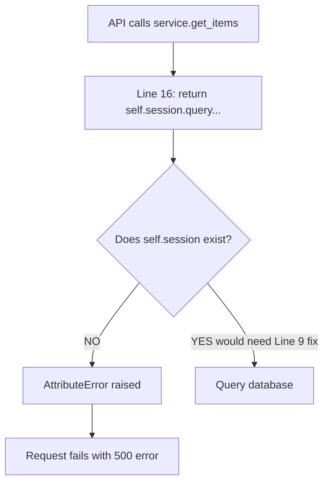

# Inventory Service Issue Documentation: Why You Can't Get Items

## Problem Statement

The `get_items()` method in [inventory_service.py](file:///c:/Users/francis/OneDrive/Desktop/Templated/Inventory/services/inventory_service.py) **will crash with an AttributeError** because it references an attribute that doesn't exist.

---

## Root Cause Analysis

### The Fatal Error on Line 16

```python
# Line 9:
self.inventory = SessionLocal()  # ✅ Creates session, names it 'inventory'

# Line 16:
return self.session.query(Product).all()  # ❌ CRASHES! No 'self.session' exists
```

**Error you'll see:**
```
AttributeError: 'InventoryService' object has no attribute 'session'
```

### Why This Happens

| Line | Code | What It Does | Problem |
|------|------|--------------|---------|
| 9 | `self.inventory = SessionLocal()` | Creates DB session called `inventory` | Wrong name |
| 16 | `return self.session.query(...)` | Tries to use `session` | **Doesn't exist!** |

---

## Complete Code Analysis

### Current Implementation (BROKEN)

```python
from database import SessionLocal
from models import Product

class InventoryService:
    def __init__(self):
        # Preload sample data
        self.inventory = SessionLocal()  # ❌ Line 9: Named 'inventory'
        
    def add_item(self, data):
        self.inventory.append(data)  # ❌ Line 12: Session is not a list!
        return {'message': 'Item added', 'item': data}
    
    def get_items(self):
        return self.session.query(Product).all()  # ❌ Line 16: self.session not defined!
    
    def get_item(self, item_id):
        return next((i for i in self.inventory if i['id'] == item_id), None)  # ❌ Line 19: Treats session as list
    
    def update_item(self, item_id, data):
        for item in self.inventory:  # ❌ Line 22: Iterating over session object
            if item['id'] == item_id:
                item.update(data)
                return {'message': 'Item updated', 'item': item}
        return {'message': 'Item not found'}
    
    def delete_item(self, item_id):
        exists = any(i['id'] == item_id for i in self.inventory)  # ❌ Line 29: Treating session as list
        self.inventory = [i for i in self.inventory if i['id'] != item_id]  # ❌ Line 30: List comprehension on session
        return {'message': 'Item deleted'} if exists else {'message': 'Item not found'}
```

### Issues Summary

| Line | Issue Type | Description | Will Crash? |
|------|------------|-------------|-------------|
| 9 | Naming inconsistency | Variable named `inventory` but used as `session` | No |
| 12 | Type mismatch | Calling `.append()` on SQLAlchemy session | 🔴 **YES** |
| 16 | Undefined attribute | Using `self.session` which doesn't exist | 🔴 **YES** |
| 19 | Type mismatch | Treating session as iterable list | 🔴 **YES** |
| 22-25 | Type mismatch | Iterating session like a list | 🔴 **YES** |
| 29-30 | Type mismatch | List operations on session object | 🔴 **YES** |

> [!CAUTION]
> **Every single method in this service will crash!** The class mixes database session operations with Python list operations, which are completely incompatible.

---

## Why get_items() Specifically Fails

### Execution Flow



### What Actually Happens

1. **API Route** ([inventory_routes.py:19](file:///c:/Users/francis/OneDrive/Desktop/Templated/Inventory/api/inventory_routes.py#L19)) calls `service.get_items()`
2. **service.get_items()** tries to access `self.session`
3. **Python looks for** `self.session` attribute
4. **Not found!** Only `self.inventory` exists (created on line 9)
5. **AttributeError raised**
6. **Flask returns 500 Internal Server Error**

### Terminal Error Output

When you call the API, you'll see:
```
AttributeError: 'InventoryService' object has no attribute 'session'
[2025-11-28 07:23:05] ERROR in app: Exception on /api/items [GET]
```

---

## The Conceptual Problem

The code confuses **two completely different paradigms**:

### What the Code Tries to Do (Impossible Mix):

```python
self.inventory = SessionLocal()  # Creates a DATABASE SESSION object

# Then tries to use it as a LIST:
self.inventory.append(data)           # ❌ Sessions don't have .append()
for item in self.inventory:           # ❌ Can't iterate sessions like lists
self.inventory = [...]                # ❌ Can't reassign session to list
```

### What Sessions Actually Are:

SQLAlchemy `Session` objects are **database connection managers**, not data containers. They:
- Execute database queries
- Track object changes
- Commit transactions

They do **NOT** behave like lists!

---

## Additional Critical Issue: Incomplete SKU Column

Your [models.py:16](file:///c:/Users/francis/OneDrive/Desktop/Templated/Inventory/models.py#L16) still has:

```python
sku = Column  # ❌ INCOMPLETE!
```

This will cause errors when creating Product objects. It should be:

```python
sku = Column(String)  # ✅ Correct
```

---

## Complete Fix

### Fixed inventory_service.py

Replace the entire file with this correct implementation:

```python
from database import SessionLocal
from models import Product
from sqlalchemy.exc import SQLAlchemyError


class InventoryService:
    def __init__(self):
        """Initialize the inventory service with a database session."""
        self.session = SessionLocal()  # ✅ Correct name
        
    def add_item(self, data):
        """Add a new product to the database."""
        try:
            # Create Product instance from dictionary
            product = Product(
                id=data.get('id'),
                name=data.get('name'),
                category=data.get('category'),
                quantity=data.get('quantity'),
                unit=data.get('unit'),
                expirationDate=data.get('expirationDate'),
                supplier=data.get('supplier'),
                price=data.get('price'),
                sku=data.get('sku')
            )
            
            # Add to session and commit
            self.session.add(product)
            self.session.commit()
            self.session.refresh(product)
            
            # Return success response
            return {
                'message': 'Item added',
                'item': self._product_to_dict(product)
            }
        except SQLAlchemyError as e:
            self.session.rollback()
            return {'message': f'Error adding item: {str(e)}'}
    
    def get_items(self):
        """Retrieve all products from the database."""
        try:
            # Query all products
            products = self.session.query(Product).all()
            
            # Convert to list of dictionaries
            return [self._product_to_dict(p) for p in products]
        except SQLAlchemyError as e:
            return {'error': f'Error retrieving items: {str(e)}'}
    
    def get_item(self, item_id):
        """Retrieve a single product by ID."""
        try:
            # Query single product
            product = self.session.query(Product).filter(
                Product.id == item_id
            ).first()
            
            if product is None:
                return None
            
            return self._product_to_dict(product)
        except SQLAlchemyError as e:
            return {'error': f'Error retrieving item: {str(e)}'}
    
    def update_item(self, item_id, data):
        """Update an existing product."""
        try:
            # Find product
            product = self.session.query(Product).filter(
                Product.id == item_id
            ).first()
            
            if product is None:
                return {'message': 'Item not found'}
            
            # Update attributes
            for key, value in data.items():
                if hasattr(product, key) and key != 'id':  # Don't update ID
                    setattr(product, key, value)
            
            # Commit changes
            self.session.commit()
            
            return {
                'message': 'Item updated',
                'item': self._product_to_dict(product)
            }
        except SQLAlchemyError as e:
            self.session.rollback()
            return {'message': f'Error updating item: {str(e)}'}
    
    def delete_item(self, item_id):
        """Delete a product by ID."""
        try:
            # Find product
            product = self.session.query(Product).filter(
                Product.id == item_id
            ).first()
            
            if product is None:
                return {'message': 'Item not found'}
            
            # Delete from database
            self.session.delete(product)
            self.session.commit()
            
            return {'message': 'Item deleted'}
        except SQLAlchemyError as e:
            self.session.rollback()
            return {'message': f'Error deleting item: {str(e)}'}
    
    def _product_to_dict(self, product):
        """Convert Product object to dictionary."""
        return {
            'id': product.id,
            'name': product.name,
            'category': product.category,
            'quantity': product.quantity,
            'unit': product.unit,
            'expirationDate': product.expirationDate,
            'supplier': product.supplier,
            'price': product.price,
            'sku': product.sku
        }
    
    def __del__(self):
        """Clean up session when service is destroyed."""
        if hasattr(self, 'session'):
            self.session.close()
```

### Also Fix models.py Line 16

```python
# Change:
sku = Column

# To:
sku = Column(String)
```

---

## Testing After Fix

### 1. Stop Your Running Flask Server
Press `Ctrl+C` in the terminal

### 2. Apply the Fixes
- Replace [inventory_service.py](file:///c:/Users/francis/OneDrive/Desktop/Templated/Inventory/services/inventory_service.py) with the corrected code above
- Fix line 16 in [models.py](file:///c:/Users/francis/OneDrive/Desktop/Templated/Inventory/models.py#L16)

### 3. Restart the Server
```bash
python app.py
```

### 4. Test get_items Endpoint
```bash
curl http://localhost:5000/api/items
```

**Expected (before adding data):**
```json
[]
```

### 5. Add a Product
```bash
curl -X POST http://localhost:5000/api/items \
  -H "Content-Type: application/json" \
  -d '{
    "id": "TEST001",
    "name": "Test Product",
    "category": "Electronics",
    "quantity": 10,
    "unit": 1,
    "expirationDate": "2025-12-31",
    "supplier": "Test Supplier",
    "price": 99.99,
    "sku": "SKU001"
  }'
```

### 6. Get Items Again
```bash
curl http://localhost:5000/api/items
```

**Expected:**
```json
[
  {
    "id": "TEST001",
    "name": "Test Product",
    "category": "Electronics",
    "quantity": 10,
    "unit": 1,
    "expirationDate": "2025-12-31",
    "supplier": "Test Supplier",
    "price": 99.99,
    "sku": "SKU001"
  }
]
```

---

## Summary

### Why You Can't Get Items:

| Problem | Cause | Line | Solution |
|---------|-------|------|----------|
| **Primary** | `self.session` doesn't exist | 16 | Change line 9 to use `self.session` |
| **Secondary** | Session treated as list | 12, 19, 22-30 | Use proper SQLAlchemy query methods |
| **Tertiary** | Incomplete sku column | models.py:16 | Add `(String)` to Column definition |

> [!IMPORTANT]
> The service layer has a fundamental design flaw: it confuses database sessions with Python lists. Every method needs to be rewritten to use SQLAlchemy's query API instead of list operations.

**After applying the fixes above, your inventory system will work correctly!**
