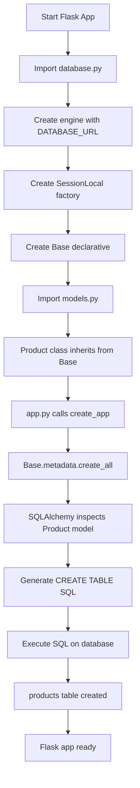
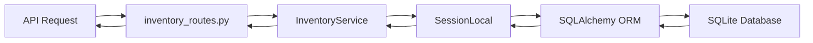

# SQLite Setup Documentation for Inventory System

## Overview

This document provides comprehensive documentation for the SQLite database setup in your Flask-based Inventory Management System. It analyzes your current implementation and provides the correct setup procedure.

---

## Current Architecture

### File Structure

```
Inventory/
├── app.py                      # Flask application entry point
├── database.py                 # SQLAlchemy database configuration
├── models.py                   # Database models (Product)
├── api/
│   └── inventory_routes.py    # REST API endpoints
└── services/
    └── inventory_service.py   # Business logic layer
```

---

## 1. Database Configuration

### File: [database.py](file:///c:/Users/francis/OneDrive/Desktop/Templated/Inventory/database.py)

```python
# database.py
from sqlalchemy import create_engine
from sqlalchemy.orm import sessionmaker, declarative_base

DATABASE_URL = 'sqlite:///inventory.db'

engine = create_engine(DATABASE_URL, echo=True)
SessionLocal = sessionmaker(bind=engine)

Base = declarative_base()
```

#### Components Explained:

| Component        | Purpose                           | Current Value                              |
| ---------------- | --------------------------------- | ------------------------------------------ |
| `DATABASE_URL` | SQLite database file path         | `sqlite:///inventory.db`                 |
| `engine`       | Database connection engine        | Created with `echo=True` for SQL logging |
| `SessionLocal` | Session factory for DB operations | Bound to the engine                        |
| `Base`         | Declarative base for ORM models   | Used by Product model                      |

#### Database Location:

- **Relative path**: `./inventory.db` (in project root)
- **Full path**: `c:\Users\francis\OneDrive\Desktop\Templated\Inventory\inventory.db`

---

## 2. Data Models

### File: [models.py](file:///c:/Users/francis/OneDrive/Desktop/Templated/Inventory/models.py)

#### Current Implementation (Has Issues):

```python
from sqlalchemy import Column, String, Integer, Float
from database import Base

class Product(Base):
    __tablename__ = 'products'

    id = Column(String, primary_key=True)
    name = Column(String)
    category = Column(String)
    quantity = Column(Integer)
    unit = Column(Integer)
    expirationDate = Column(String)
    supplier = Column(String)
    price = Column(Float)
    sku = Column  # ❌ ISSUE: Incomplete!
```

#### Product Model Schema:

| Column             | Type            | Constraints | Description                        |
| ------------------ | --------------- | ----------- | ---------------------------------- |
| `id`             | String          | Primary Key | Unique product identifier          |
| `name`           | String          | -           | Product name                       |
| `category`       | String          | -           | Product category                   |
| `quantity`       | Integer         | -           | Stock quantity                     |
| `unit`           | Integer         | -           | Unit of measurement                |
| `expirationDate` | String          | -           | Expiration date (stored as string) |
| `supplier`       | String          | -           | Supplier name                      |
| `price`          | Float           | -           | Product price                      |
| `sku`            | ⚠️ Incomplete | -           | Stock Keeping Unit                 |

> [!CAUTION]
> **Line 16 Issue**: `sku = Column` is incomplete and will cause errors. Should be `sku = Column(String)`.

---

## 3. Flask Application

### File: [app.py](file:///c:/Users/francis/OneDrive/Desktop/Templated/Inventory/app.py)

#### Current Implementation:

```python
from flask import Flask
from api.inventory_routes import inventory_bp
from flask_cors import CORS

def create_app():
    app = Flask(__name__)
  
    # Enable CORS (critical for React frontend)
    CORS(app)
  
    # Register your blueprint
    app.register_blueprint(inventory_bp, url_prefix='/api/items')
  
    return app

if __name__ == '__main__':
    app = create_app()
    app.run(debug=True)
```

> [!WARNING]
> **Critical Missing Code**: No database initialization! Tables are never created.

---

## 4. API Routes

### File: [api/inventory_routes.py](file:///c:/Users/francis/OneDrive/Desktop/Templated/Inventory/api/inventory_routes.py)

#### Endpoints:

| Method     | Endpoint                 | Function          | Description        |
| ---------- | ------------------------ | ----------------- | ------------------ |
| `POST`   | `/api/items`           | `add_item()`    | Create new product |
| `GET`    | `/api/items`           | `get_items()`   | List all products  |
| `GET`    | `/api/items/<item_id>` | `get_item()`    | Get single product |
| `DELETE` | `/api/items/<item_id>` | `delete_item()` | Delete product     |

#### Current Code:

```python
from flask import Blueprint, request, jsonify
from services.inventory_service import InventoryService

inventory_bp = Blueprint('inventory', __name__)
service = InventoryService()

@inventory_bp.route("", methods=["POST"])
def add_item():
    data = request.get_json()
    result = service.add_item(data)
    return jsonify(result), 201

@inventory_bp.route("", methods=['GET'])
def get_items():
    return jsonify(service.get_items()), 200

@inventory_bp.route("/<item_id>", methods=['GET'])
def get_item(item_id):
    result = service.get_item(item_id)
    if result is None:
        return jsonify({"error", "Item not found"}), 404
    return jsonify(result), 200

@inventory_bp.route("/<item_id>", methods=['DELETE'])
def delete_item(item_id):
    service.delete_item(item_id)
    return jsonify({'message': 'Item deleted'}), 200
```

---

## 5. Business Logic Service

### File: [services/inventory_service.py](file:///c:/Users/francis/OneDrive/Desktop/Templated/Inventory/services/inventory_service.py)

#### Current Implementation (Multiple Issues):

```python
from database import SessionLocal
from models import Product

class InventoryService:
    def __init__(self):
        # Preload sample data
        self.inventory = SessionLocal()  # ❌ Creates session, named as inventory
      
    def add_item(self, data):
        self.inventory.append(data)  # ❌ Treats session as list!
        return {'message': 'Item added', 'item': data}
  
    def get_items(self):
        return self.session.query(Product).all()  # ❌ Uses undefined self.session
  
    def get_item(self, item_id):
        return next((i for i in self.inventory if i['id'] == item_id), None)
  
    def update_item(self, item_id, data):
        for item in self.inventory:
            if item['id'] == item_id:
                item.update(data)
                return {'message': 'Item updated', 'item': item}
        return {'message': 'Item not found'}
  
    def delete_item(self, item_id):
        exists = any(i['id'] == item_id for i in self.inventory)
        self.inventory = [i for i in self.inventory if i['id'] != item_id]
        return {'message': 'Item deleted'} if exists else {'message': 'Item not found'}
```

#### Issues Identified:

| Line  | Issue                                                  | Severity    |
| ----- | ------------------------------------------------------ | ----------- |
| 9     | `self.inventory` is a SQLAlchemy session, not a list | 🔴 Critical |
| 12    | Calling `.append()` on a session object              | 🔴 Critical |
| 16    | Using `self.session` which doesn't exist             | 🔴 Critical |
| 19-31 | Treating session as iterable list                      | 🔴 Critical |

---

## Complete SQLite Setup Guide

### Step 1: Fix the Product Model

**File: [models.py](file:///c:/Users/francis/OneDrive/Desktop/Templated/Inventory/models.py)**

```python
from sqlalchemy import Column, String, Integer, Float
from database import Base

class Product(Base):
    __tablename__ = 'products'

    id = Column(String, primary_key=True)
    name = Column(String)
    category = Column(String)
    quantity = Column(Integer)
    unit = Column(Integer)
    expirationDate = Column(String)
    supplier = Column(String)
    price = Column(Float)
    sku = Column(String)  # ✅ Fixed!
```

### Step 2: Add Database Initialization

**File: [app.py](file:///c:/Users/francis/OneDrive/Desktop/Templated/Inventory/app.py)**

```python
from flask import Flask
from api.inventory_routes import inventory_bp
from flask_cors import CORS
from database import engine, Base  # ✅ Add these imports
from models import Product  # ✅ Add this import

def create_app():
    app = Flask(__name__)
  
    # Enable CORS (critical for React frontend)
    CORS(app)
  
    # ✅ CREATE DATABASE TABLES
    with app.app_context():
        Base.metadata.create_all(bind=engine)
        print("✅ Database tables created successfully!")
  
    # Register your blueprint
    app.register_blueprint(inventory_bp, url_prefix='/api/items')
  
    return app

if __name__ == '__main__':
    app = create_app()
    app.run(debug=True)
```

### Step 3: Fix the Inventory Service

**File: [services/inventory_service.py](file:///c:/Users/francis/OneDrive/Desktop/Templated/Inventory/services/inventory_service.py)**

```python
from database import SessionLocal
from models import Product

class InventoryService:
    def __init__(self):
        # Create database session
        self.session = SessionLocal()  # ✅ Renamed to self.session
      
    def add_item(self, data):
        # Create Product instance and add to database
        product = Product(**data)
        self.session.add(product)
        self.session.commit()
        self.session.refresh(product)
      
        # Return serialized data
        return {
            'message': 'Item added',
            'item': {
                'id': product.id,
                'name': product.name,
                'category': product.category,
                'quantity': product.quantity,
                'unit': product.unit,
                'expirationDate': product.expirationDate,
                'supplier': product.supplier,
                'price': product.price,
                'sku': product.sku
            }
        }
  
    def get_items(self):
        # Query all products
        products = self.session.query(Product).all()
      
        # Serialize to dictionaries
        return [{
            'id': p.id,
            'name': p.name,
            'category': p.category,
            'quantity': p.quantity,
            'unit': p.unit,
            'expirationDate': p.expirationDate,
            'supplier': p.supplier,
            'price': p.price,
            'sku': p.sku
        } for p in products]
  
    def get_item(self, item_id):
        # Query single product by ID
        product = self.session.query(Product).filter(Product.id == item_id).first()
      
        if product is None:
            return None
          
        # Serialize to dictionary
        return {
            'id': product.id,
            'name': product.name,
            'category': product.category,
            'quantity': product.quantity,
            'unit': product.unit,
            'expirationDate': product.expirationDate,
            'supplier': product.supplier,
            'price': product.price,
            'sku': product.sku
        }
  
    def update_item(self, item_id, data):
        # Find product
        product = self.session.query(Product).filter(Product.id == item_id).first()
      
        if product is None:
            return {'message': 'Item not found'}
      
        # Update attributes
        for key, value in data.items():
            if hasattr(product, key):
                setattr(product, key, value)
      
        self.session.commit()
      
        return {
            'message': 'Item updated',
            'item': {
                'id': product.id,
                'name': product.name,
                'category': product.category,
                'quantity': product.quantity,
                'unit': product.unit,
                'expirationDate': product.expirationDate,
                'supplier': product.supplier,
                'price': product.price,
                'sku': product.sku
            }
        }
  
    def delete_item(self, item_id):
        # Find product
        product = self.session.query(Product).filter(Product.id == item_id).first()
      
        if product is None:
            return {'message': 'Item not found'}
      
        # Delete from database
        self.session.delete(product)
        self.session.commit()
      
        return {'message': 'Item deleted'}
  
    def __del__(self):
        # Clean up session when service is destroyed
        if hasattr(self, 'session'):
            self.session.close()
```

---

## How SQLite Setup Works

### Initialization Flow:



### Database Operations Flow:



---

## Testing the Setup

### 1. Start the Application

```bash
python app.py
```

**Expected output:**

```
 * Serving Flask app 'app'
 * Debug mode: on
✅ Database tables created successfully!
 * Running on http://127.0.0.1:5000
```

### 2. Verify Database Tables

```bash
sqlite3 inventory.db
.tables
.schema products
```

**Expected output:**

```
products
```

### 3. Test API Endpoints

#### Create Product:

```bash
curl -X POST http://localhost:5000/api/items \
  -H "Content-Type: application/json" \
  -d '{
    "id": "PROD001",
    "name": "Test Product",
    "category": "Electronics",
    "quantity": 100,
    "unit": 1,
    "expirationDate": "2025-12-31",
    "supplier": "ACME Corp",
    "price": 299.99,
    "sku": "SKU-001"
  }'
```

#### Get All Products:

```bash
curl http://localhost:5000/api/items
```

#### Get Single Product:

```bash
curl http://localhost:5000/api/items/PROD001
```

#### Delete Product:

```bash
curl -X DELETE http://localhost:5000/api/items/PROD001
```

---

## Summary of Required Fixes

| File                                                                                                             | Line         | Current Code                        | Fixed Code                                |
| ---------------------------------------------------------------------------------------------------------------- | ------------ | ----------------------------------- | ----------------------------------------- |
| [models.py](file:///c:/Users/francis/OneDrive/Desktop/Templated/Inventory/models.py)                                | 16           | `sku = Column`                    | `sku = Column(String)`                  |
| [app.py](file:///c:/Users/francis/OneDrive/Desktop/Templated/Inventory/app.py)                                      | After line 9 | Missing initialization              | `Base.metadata.create_all(bind=engine)` |
| [inventory_service.py](file:///c:/Users/francis/OneDrive/Desktop/Templated/Inventory/services/inventory_service.py) | 9            | `self.inventory = SessionLocal()` | `self.session = SessionLocal()`         |
| [inventory_service.py](file:///c:/Users/francis/OneDrive/Desktop/Templated/Inventory/services/inventory_service.py) | 11-31        | List operations                     | Proper SQLAlchemy operations              |

> [!IMPORTANT]
> After applying these fixes, delete the old `inventory.db` file and restart the Flask app to create a fresh database with proper schema.
