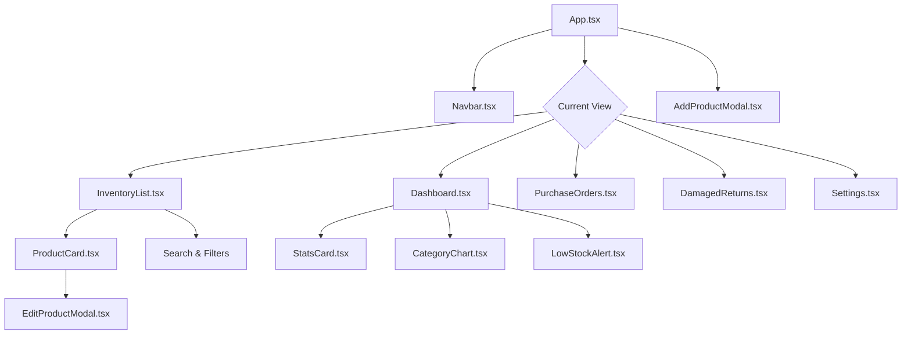
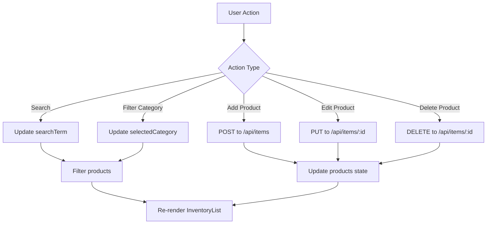
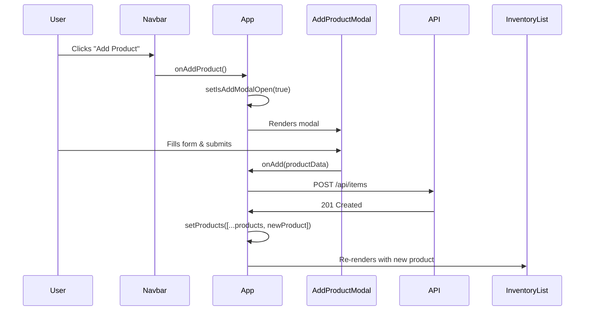
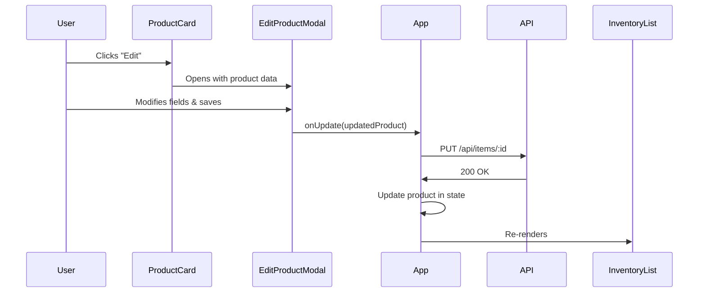
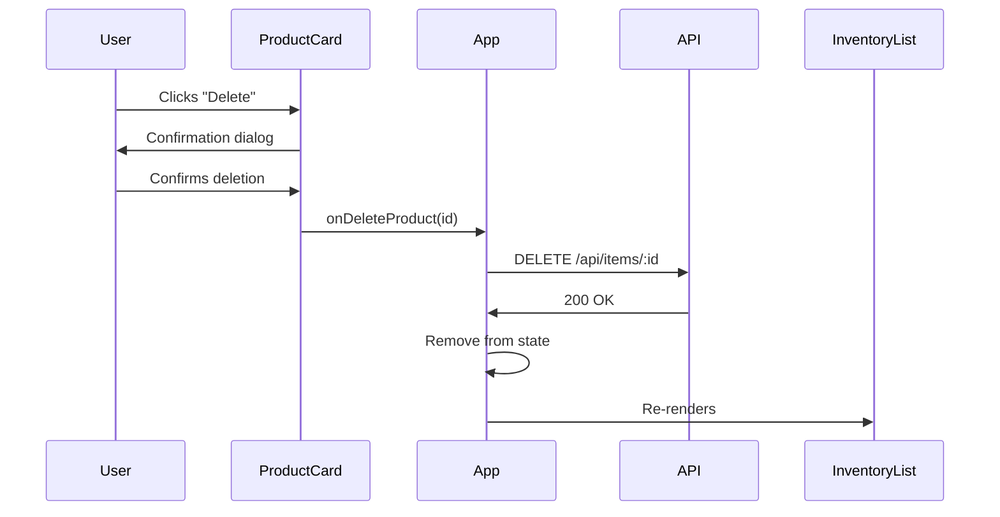

# Inventory Management System - UI Documentation

## Table of Contents
1. [UI Architecture Overview](#ui-architecture-overview)
2. [Component Breakdown](#component-breakdown)
3. [InventoryList Component](#inventorylist-component)
4. [ProductCard Component](#productcard-component)
5. [Modal Components](#modal-components)
6. [Navigation & Layout](#navigation--layout)
7. [State Management](#state-management)
8. [Styling & Design System](#styling--design-system)
9. [User Interactions](#user-interactions)

---

## UI Architecture Overview

### Technology Stack

```
Frontend Stack:
├── React 18 (UI Library)
├── TypeScript (Type Safety)
├── Tailwind CSS (Styling)
├── Vite (Build Tool)
├── Lucide React (Icons)
└── Fetch API (Backend Communication)
```

### Component Hierarchy



### File Structure

```
Inventory/
├── App.tsx                          # Main app component
├── main.tsx                         # React entry point
├── index.html                       # HTML template
├── globals.css                      # Global styles
│
└── components/
    ├── InventoryList.tsx           # Product list view with filters
    ├── ProductCard.tsx             # Individual product display
    ├── AddProductModal.tsx         # Add product dialog
    ├── EditProductModal.tsx        # Edit product dialog
    ├── Dashboard.tsx               # Dashboard overview
    ├── Navbar.tsx                  # Top navigation bar
    ├── PurchaseOrders.tsx          # Purchase orders view
    ├── DamagedReturns.tsx          # Damaged/returns view
    ├── Settings.tsx                # Settings page
    ├── StatsCard.tsx               # Statistics display
    ├── CategoryChart.tsx           # Category distribution chart
    └── LowStockAlert.tsx           # Low stock warnings
```

---

## Component Breakdown

### Main App Component (App.tsx)

**Purpose:** Root component that manages application state and routing

**Key Responsibilities:**
- Manages product data state
- Handles view navigation
- Fetches data from Flask backend
- Provides CRUD operations for products

**Code Structure:**
```typescript
export default function App() {
  // State
  const [products, setProducts] = useState<Product[]>([]);
  const [currentView, setCurrentView] = useState('dashboard');
  const [isAddModalOpen, setIsAddModalOpen] = useState(false);

  // Fetch products from API on load
  useEffect(() => {
    fetch('http://localhost:5000/api/items')
      .then(res => res.json())
      .then(data => setProducts(data))
      .catch(err => console.error('Error:', err));
  }, []);

  // CRUD handlers
  const handleAddProduct = (product) => { /* ... */ };
  const handleDeleteProduct = (id) => { /* ... */ };
  const handleUpdateProduct = (product) => { /* ... */ };

  // Render current view
  return (
    <div>
      <Navbar />
      <main>
        {currentView === 'inventory' && <InventoryList />}
        {/* Other views */}
      </main>
    </div>
  );
}
```

**Product Interface:**
```typescript
export interface Product {
  id: string;               // Unique identifier
  name: string;             // Product name
  category: string;         // Category (e.g., "Supplements")
  quantity: number;         // Current stock
  unit: string;             // Unit of measure (e.g., "bottles")
  reorderLevel: number;     // Low stock threshold
  expirationDate: string;   // Expiry date (ISO format)
  batchNumber: string;      // Batch/lot number
  supplier: string;         // Supplier name
  price: number;            // Unit price
  sku: string;              // Stock Keeping Unit
}
```

---

## InventoryList Component

**File:** [InventoryList.tsx](file:///c:/Users/francis/OneDrive/Desktop/Templated/Inventory/components/InventoryList.tsx)

### Purpose
Main component for displaying and filtering the product inventory

### Visual Layout

```
┌─────────────────────────────────────────────────────┐
│  Inventory Management                                │
│  Manage your food supplement inventory               │
├─────────────────────────────────────────────────────┤
│  ┌──────────────────────┐  ┌──────────────────┐    │
│  │ 🔍 Search...         │  │ 🔽 All Categories │    │
│  └──────────────────────┘  └──────────────────┘    │
├─────────────────────────────────────────────────────┤
│  Showing 12 of 15 products                          │
├─────────────────────────────────────────────────────┤
│  ┌──────────────────┐  ┌──────────────────┐        │
│  │  Product Card    │  │  Product Card    │        │
│  │  [Details...]    │  │  [Details...]    │        │
│  └──────────────────┘  └──────────────────┘        │
│  ┌──────────────────┐  ┌──────────────────┐        │
│  │  Product Card    │  │  Product Card    │        │
│  └──────────────────┘  └──────────────────┘        │
└─────────────────────────────────────────────────────┘
```

### Component Props

```typescript
interface InventoryListProps {
  products: Product[];                      // Array of all products
  onDeleteProduct: (id: string) => void;    // Delete handler
  onUpdateProduct: (product: Product) => void; // Update handler
}
```

### State Management

```typescript
const [searchTerm, setSearchTerm] = useState('');         // Search input
const [selectedCategory, setSelectedCategory] = useState('all'); // Filter
```

### Key Features

#### 1. **Search Functionality** (Lines 18-23)

Searches through product names and SKUs:

```typescript
const filteredProducts = products.filter(product => {
  const matchesSearch = 
    product.name.toLowerCase().includes(searchTerm.toLowerCase()) ||
    product.sku.toLowerCase().includes(searchTerm.toLowerCase());
  
  const matchesCategory = 
    selectedCategory === 'all' || 
    product.category === selectedCategory;
  
  return matchesSearch && matchesCategory;
});
```

**How it works:**
- User types in search box
- Filter checks both `name` and `sku` fields
- Case-insensitive matching
- Real-time results (updates as you type)

#### 2. **Category Filter** (Lines 48-62)

Dynamic dropdown populated from existing categories:

```typescript
const categories = [
  'all', 
  ...Array.from(new Set(products.map(p => p.category)))
];
```

**How it works:**
- Extracts unique categories from all products
- Creates dropdown with "All Categories" + unique values
- Filters products when selection changes

#### 3. **Results Display** (Lines 67-70)

Shows count of filtered vs total:

```typescript
<p>Showing {filteredProducts.length} of {products.length} products</p>
```

Example: "Showing 8 of 24 products"

#### 4. **Grid Layout** (Lines 79-88)

Responsive grid that adapts to screen size:

```typescript
<div className="grid grid-cols-1 lg:grid-cols-2 gap-6">
  {filteredProducts.map(product => (
    <ProductCard
      key={product.id}
      product={product}
      onDelete={onDeleteProduct}
      onUpdate={onUpdateProduct}
    />
  ))}
</div>
```

**Responsive behavior:**
- Mobile (< 1024px): 1 column
- Desktop (≥ 1024px): 2 columns
- Gap of 24px (1.5rem) between cards

#### 5. **Empty State** (Lines 74-77)

Shown when no products match filters:

```typescript
{filteredProducts.length === 0 ? (
  <div className="text-center">
    <p>No products found matching your criteria</p>
  </div>
) : (
  /* Product grid */
)}
```

---

## ProductCard Component

**File:** [ProductCard.tsx](file:///c:/Users/francis/OneDrive/Desktop/Templated/Inventory/components/ProductCard.tsx)

### Purpose
Displays individual product information with actions

### Visual Design

```
┌────────────────────────────────────────────────┐
│ Vitamin C 1000mg                          ⋮    │ ← Menu
│ SKU: VIT-C-1000                                 │
├────────────────────────────────────────────────┤
│ Category: Supplements                          │
│ Supplier: HealthCo Inc.                        │
│ Batch: BATCH2024001                            │
│ Expires: Dec 31, 2025                          │
├────────────────────────────────────────────────┤
│ Stock: 150 bottles                             │
│ Price: $24.99                                  │
│ Reorder at: 20 bottles                         │
├────────────────────────────────────────────────┤
│  [View Details] [Edit] [Delete]                │
└────────────────────────────────────────────────┘
```

### Props Interface

```typescript
interface ProductCardProps {
  product: Product;                  // Product data
  onDelete: (id: string) => void;    // Delete callback
  onUpdate: (product: Product) => void; // Update callback
}
```

### Features

1. **Product Information Display**
   - Name and SKU prominently shown
   - Category, supplier, batch number
   - Expiration date
   - Stock quantity with unit
   - Price and reorder level

2. **Actions Menu**
   - Edit product (opens modal)
   - Delete product (with confirmation)
   - View detailed information

3. **Visual Indicators**
   - Low stock warning (when quantity ≤ reorderLevel)
   - Near expiration alerts
   - Color-coded status

---

## Modal Components

### AddProductModal Component

**File:** [AddProductModal.tsx](file:///c:/Users/francis/OneDrive/Desktop/Templated/Inventory/components/AddProductModal.tsx)

**Purpose:** Dialog for adding new products

### Visual Layout

```
┌──────────────────────────────────────────────┐
│  Add New Product                        ✕    │
├──────────────────────────────────────────────┤
│  Product Name: [__________]                  │
│  Category:     [__________]                  │
│  SKU:          [__________]                  │
│  Quantity:     [__________]                  │
│  Unit:         [__________]                  │
│  Price:        [__________]                  │
│  Supplier:     [__________]                  │
│  Batch #:      [__________]                  │
│  Reorder Level:[__________]                  │
│  Expiry Date:  [__________]                  │
├──────────────────────────────────────────────┤
│              [Cancel] [Add Product]          │
└──────────────────────────────────────────────┘
```

**Props:**
```typescript
interface AddProductModalProps {
  onClose: () => void;                          // Close modal
  onAdd: (product: Omit<Product, 'id'>) => void; // Add callback
}
```

**Features:**
- Form validation
- Required field indicators
- Auto-focus on first field
- Escape key to close
- Click outside to close

### EditProductModal Component

**File:** [EditProductModal.tsx](file:///c:/Users/francis/OneDrive/Desktop/Templated/Inventory/components/EditProductModal.tsx)

**Purpose:** Dialog for editing existing products

**Similar to AddProductModal but:**
- Pre-fills form with existing data
- Updates instead of creates
- Shows "Update Product" instead of "Add Product"

---

## Navigation & Layout

### Navbar Component

**File:** [Navbar.tsx](file:///c:/Users/francis/OneDrive/Desktop/Templated/Inventory/components/Navbar.tsx)

### Visual Design

```
┌────────────────────────────────────────────────────────┐
│ 📦 Inventory System      [Dashboard] [Inventory] ...  │
│                                          [+ Add Product]│
└────────────────────────────────────────────────────────┘
```

**Props:**
```typescript
interface NavbarProps {
  currentView: string;                    // Active view
  onViewChange: (view: string) => void;   // View switch handler
  onAddProduct: () => void;               // Add product handler
}
```

**Navigation Items:**
1. **Dashboard** - Overview and statistics
2. **Inventory** - Product list
3. **Purchase Orders** - PO management
4. **Damaged Returns** - Track damaged items
5. **Settings** - App configuration

**Features:**
- Active view highlighting
- Quick add product button
- Responsive menu (mobile)
- Logo/branding

---

## State Management

### Data Flow Diagram



### State Location

| State | Location | Purpose |
|-------|----------|---------|
| `products` | App.tsx | All product data |
| `currentView` | App.tsx | Active page/view |
| `isAddModalOpen` | App.tsx | Add modal visibility |
| `searchTerm` | InventoryList.tsx | Search input value |
| `selectedCategory` | InventoryList.tsx | Filter selection |

### Props Drilling

```
App.tsx
  ├─ products ────────────┐
  │                       ↓
  └─ InventoryList.tsx ───┼─> ProductCard.tsx
        │                 │
        ├─ searchTerm     │
        └─ selectedCategory
```

---

## Styling & Design System

### Tailwind CSS Classes Used

#### Color Palette

```css
/* Primary Colors */
bg-emerald-500    /* Primary brand color */
bg-emerald-600    /* Hover states */
text-emerald-600  /* Links and accents */

/* Neutral Colors */
bg-gray-50        /* Background */
bg-white          /* Cards and containers */
text-gray-900     /* Primary text */
text-gray-600     /* Secondary text */
border-gray-200   /* Borders */
```

#### Component Styles

**Cards:**
```css
bg-white 
rounded-xl 
p-4 
shadow-sm 
border 
border-gray-200
```

**Input Fields:**
```css
border 
border-gray-300 
rounded-lg 
focus:outline-none 
focus:ring-2 
focus:ring-emerald-500 
focus:border-transparent
```

**Buttons:**
```css
/* Primary */
bg-emerald-500 
text-white 
px-4 
py-2 
rounded-lg 
hover:bg-emerald-600

/* Secondary */
border 
border-gray-300 
text-gray-700 
hover:bg-gray-50
```

### Responsive Design

**Breakpoints:**
```css
sm:  640px   /* Tablet */
md:  768px   /* Small desktop */
lg:  1024px  /* Desktop */
xl:  1280px  /* Large desktop */
```

**InventoryList Responsiveness:**
```tsx
{/* Mobile: Stack vertically */}
<div className="flex flex-col sm:flex-row gap-4">
  {/* Search and filter */}
</div>

{/* Desktop: 2 columns */}
<div className="grid grid-cols-1 lg:grid-cols-2 gap-6">
  {/* Product cards */}
</div>
```

---

## User Interactions

### Search Flow

1. User types in search box
2. `onChange` event fires
3. `setSearchTerm` updates state
4. Component re-renders
5. `filteredProducts` recalculates
6. Grid updates with filtered results

**Code:**
```typescript
<input
  value={searchTerm}
  onChange={(e) => setSearchTerm(e.target.value)}
  placeholder="Search by name or SKU..."
/>
```

### Category Filter Flow

1. User clicks dropdown
2. Selects category
3. `onChange` event fires
4. `setSelectedCategory` updates state
5. `filteredProducts` recalculates
6. Grid updates

**Code:**
```typescript
<select
  value={selectedCategory}
  onChange={(e) => setSelectedCategory(e.target.value)}
>
  {categories.map(cat => (
    <option key={cat} value={cat}>
      {cat === 'all' ? 'All Categories' : cat}
    </option>
  ))}
</select>
```

### Add Product Flow



### Edit Product Flow



### Delete Product Flow



---

## API Integration

### Fetching Products

**Location:** App.tsx, lines 65-70

```typescript
useEffect(() => {
  fetch('http://localhost:5000/api/items')
    .then(res => res.json())
    .then(data => setProducts(data))
    .catch(err => console.error('Error loading products:', err));
}, []);
```

**Explanation:**
- Runs once when app loads (empty dependency array `[]`)
- Fetches all products from Flask backend
- Updates `products` state with response
- Logs errors to console

### Creating Products

```typescript
const handleAddProduct = (product: Omit<Product, 'id'>) => {
  const newProduct: Product = {
    ...product,
    id: Date.now().toString()  // Generate temp ID
  };
  
  // Optimistic update (update UI immediately)
  setProducts([...products, newProduct]);
  
  // TODO: Send to backend
  // fetch('http://localhost:5000/api/items', {
  //   method: 'POST',
  //   headers: { 'Content-Type': 'application/json' },
  //   body: JSON.stringify(newProduct)
  // });
};
```

### Updating Products

```typescript
const handleUpdateProduct = (updatedProduct: Product) => {
  setProducts(
    products.map(p => 
      p.id === updatedProduct.id ? updatedProduct : p
    )
  );
  
  // TODO: Send to backend
  // fetch(`http://localhost:5000/api/items/${updatedProduct.id}`, {
  //   method: 'PUT',
  //   headers: { 'Content-Type': 'application/json' },
  //   body: JSON.stringify(updatedProduct)
  // });
};
```

### Deleting Products

```typescript
const handleDeleteProduct = (id: string) => {
  setProducts(products.filter(p => p.id !== id));
  
  // TODO: Send to backend
  // fetch(`http://localhost:5000/api/items/${id}`, {
  //   method: 'DELETE'
  // });
};
```

> [!NOTE]
> Currently, create/update/delete operations only update local state. You'll need to add actual API calls to persist changes to the database.

---

## Component Usage Examples

### Using InventoryList

```typescript
import { InventoryList } from './components/InventoryList';

function App() {
  const [products, setProducts] = useState([]);

  const handleDelete = (id: string) => {
    setProducts(products.filter(p => p.id !== id));
  };

  const handleUpdate = (updatedProduct: Product) => {
    setProducts(
      products.map(p => p.id === updatedProduct.id ? updatedProduct : p)
    );
  };

  return (
    <InventoryList
      products={products}
      onDeleteProduct={handleDelete}
      onUpdateProduct={handleUpdate}
    />
  );
}
```

### Using ProductCard

```typescript
import { ProductCard } from './components/ProductCard';

const product = {
  id: '1',
  name: 'Vitamin C',
  category: 'Supplements',
  quantity: 150,
  // ... other fields
};

<ProductCard
  product={product}
  onDelete={(id) => console.log('Delete', id)}
  onUpdate={(p) => console.log('Update', p)}
/>
```

---

## Summary

### Key Takeaways

1. **InventoryList** is the main product display component with:
   - Search by name/SKU
   - Category filtering
   - Responsive grid layout
   - Empty state handling

2. **ProductCard** displays individual products with:
   - Full product information
   - Edit/delete actions
   - Visual status indicators

3. **State flows from top to bottom:**
   - App.tsx manages global state
   - Props pass data down
   - Callbacks pass events up

4. **Styling uses Tailwind CSS:**
   - Utility-first approach
   - Responsive by default
   - Consistent design system

5. **Backend integration via Fetch API:**
   - GET products on load
   - CRUD operations ready for implementation

### Next Steps

To complete the UI-backend integration:

1. Add POST request in `handleAddProduct`
2. Add PUT request in `handleUpdateProduct`
3. Add DELETE request in `handleDeleteProduct`
4. Add error handling and loading states
5. Add success/error notifications
6. Implement optimistic updates with rollback

---

**Happy coding! 🚀**
