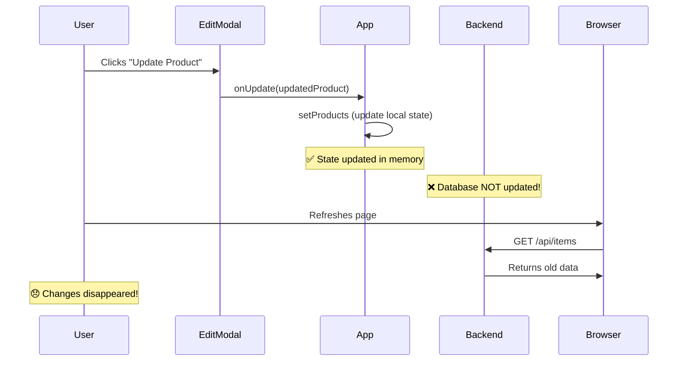
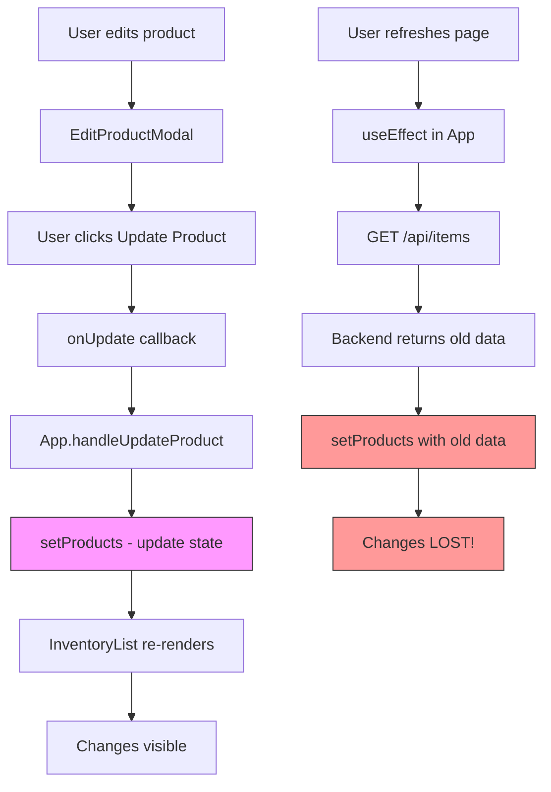
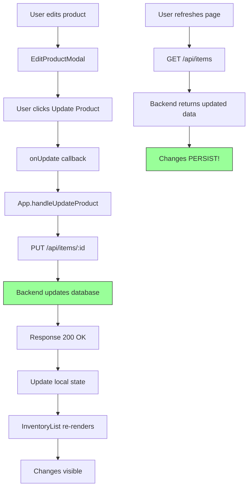

# Update Product Issue Documentation

## Problem Statement

When you edit a product using the **EditProductModal** and click "Update Product", the changes **only persist in the browser's memory** and are **lost when you refresh the page**. The update is not being saved to the database.

---

## Root Cause Analysis

### 🔍 **Three Critical Issues:**

1. **No API Call to Backend** ❌ - Frontend updates local state only
2. **Missing Backend Route** ❌ - Flask has no PUT endpoint handler  
3. **Data Schema Mismatch** ⚠️ - Frontend vs Backend have different fields

---

## Issue 1: No API Call to Backend (CRITICAL)

### Current Code Flow

**File:** [App.tsx:85-87](file:///c:/Users/francis/OneDrive/Desktop/Templated/Inventory/App.tsx#L85-L87)

```typescript
const handleUpdateProduct = (updatedProduct: Product) => {
  setProducts(products.map(p => 
    p.id === updatedProduct.id ? updatedProduct : p
  ));
  // ❌ NO API CALL - Changes only saved to React state!
};
```

### What Happens



### Why This Happens

The `handleUpdateProduct` function **only updates React state**:
- Changes are stored in browser memory
- Database remains unchanged
- Refresh reloads original data from database
- Your edits vanish!

---

## Issue 2: Missing Backend Route Handler

### Current Backend Routes

**File:** [api/inventory_routes.py](file:///c:/Users/francis/OneDrive/Desktop/Templated/Inventory/api/inventory_routes.py)

```python
# Existing routes:
@inventory_bp.route("", methods=["POST"])     # ✅ Create
def add_item(): ...

@inventory_bp.route("", methods=['GET'])       # ✅ Read all
def get_items(): ...

@inventory_bp.route("/<item_id>", methods=['GET'])  # ✅ Read one
def get_item(item_id): ...

@inventory_bp.route("/<item_id>", methods=['DELETE'])  # ✅ Delete
def delete_item(item_id): ...

# ❌ MISSING: PUT/PATCH route for UPDATE!
```

**You need to add:**
```python
@inventory_bp.route("/<item_id>", methods=['PUT'])
def update_item(item_id):
    # Update logic here
```

---

## Issue 3: Data Schema Mismatch

### Frontend Product Interface

**File:** [App.tsx:10-22](file:///c:/Users/francis/OneDrive/Desktop/Templated/Inventory/App.tsx#L10-L22)

```typescript
export interface Product {
  id: string;
  name: string;
  category: string;
  quantity: number;
  unit: string;              // ⚠️ STRING (e.g., "bottles")
  reorderLevel: number;      // ⚠️ Frontend only
  expirationDate: string;
  batchNumber: string;       // ⚠️ Frontend only
  supplier: string;
  price: number;
  sku: string;
}
```

### Backend Product Model

**File:** [models.py:5-16](file:///c:/Users/francis/OneDrive/Desktop/Templated/Inventory/models.py#L5-L16)

```python
class Product(Base):
    __tablename__ = 'products'
    
    id = Column(String, primary_key=True)
    name = Column(String)
    category = Column(String)
    quantity = Column(Integer)
    unit = Column(Integer)        # ⚠️ INTEGER (not string!)
    expirationDate = Column(String)
    supplier = Column(String)
    price = Column(Float)
    sku = Column(String)
    # ❌ MISSING: reorderLevel
    # ❌ MISSING: batchNumber
```

### Mismatch Summary

| Field | Frontend Type | Backend Type | Issue |
|-------|---------------|--------------|-------|
| `unit` | `string` | `Integer` | ❌ Type mismatch |
| `reorderLevel` | `number` | N/A | ❌ Not in database |
| `batchNumber` | `string` | N/A | ❌ Not in database |

---

## Complete Update Flow (Current - BROKEN)



---

## The Complete Fix

### Step 1: Update Backend Model (Optional but Recommended)

**File:** [models.py](file:///c:/Users/francis/OneDrive/Desktop/Templated/Inventory/models.py)

Add missing fields to match frontend:

```python
from sqlalchemy import Column, String, Integer, Float

class Product(Base):
    __tablename__ = 'products'
    
    id = Column(String, primary_key=True)
    name = Column(String)
    category = Column(String)
    quantity = Column(Integer)
    unit = Column(String)              # Changed from Integer to String
    reorderLevel = Column(Integer)     # Added
    expirationDate = Column(String)
    batchNumber = Column(String)       # Added
    supplier = Column(String)
    price = Column(Float)
    sku = Column(String)               # Fixed from Column to Column(String)
```

### Step 2: Add UPDATE Route to Backend

**File:** [api/inventory_routes.py](file:///c:/Users/francis/OneDrive/Desktop/Templated/Inventory/api/inventory_routes.py)

Add this new route:

```python
@inventory_bp.route("/<item_id>", methods=['PUT'])
def update_item(item_id):
    """Update an existing product."""
    data = request.get_json()
    result = service.update_item(item_id, data)
    
    if result.get('message') == 'Item not found':
        return jsonify(result), 404
    
    return jsonify(result), 200
```

### Step 3: Update inventory_service.py

**File:** [services/inventory_service.py](file:///c:/Users/francis/OneDrive/Desktop/Templated/Inventory/services/inventory_service.py)

The `update_item` method already exists in the broken code, but here's the corrected version:

```python
def update_item(self, item_id, data):
    """Update existing product."""
    try:
        product = self.session.query(Product).filter(
            Product.id == item_id
        ).first()
        
        if not product:
            return {'message': 'Item not found'}
        
        # Update attributes
        for key, value in data.items():
            if hasattr(product, key) and key != 'id':
                setattr(product, key, value)
        
        self.session.commit()
        
        return {
            'message': 'Item updated',
            'item': self._to_dict(product)
        }
    except Exception as e:
        self.session.rollback()
        return {'error': str(e)}
```

### Step 4: Add API Call in Frontend

**File:** [App.tsx](file:///c:/Users/francis/OneDrive/Desktop/Templated/Inventory/App.tsx)

Replace the current `handleUpdateProduct` function:

```typescript
const handleUpdateProduct = async (updatedProduct: Product) => {
  try {
    // Update backend
    const response = await fetch(`http://localhost:5000/api/items/${updatedProduct.id}`, {
      method: 'PUT',
      headers: {
        'Content-Type': 'application/json',
      },
      body: JSON.stringify(updatedProduct)
    });
    
    if (!response.ok) {
      throw new Error('Failed to update product');
    }
    
    // Update local state (optimistic update)
    setProducts(products.map(p => 
      p.id === updatedProduct.id ? updatedProduct : p
    ));
    
    console.log('✅ Product updated successfully');
  } catch (error) {
    console.error('❌ Error updating product:', error);
    alert('Failed to update product. Please try again.');
    
    // Optionally reload fresh data from backend
    fetch('http://localhost:5000/api/items')
      .then(res => res.json())
      .then(data => setProducts(data));
  }
};
```

---

## Fixed Update Flow



---

## Comparison: Before vs After

### Before (BROKEN)

```typescript
// App.tsx - NO API CALL
const handleUpdateProduct = (updatedProduct: Product) => {
  setProducts(products.map(p => 
    p.id === updatedProduct.id ? updatedProduct : p
  ));
  // Changes lost on refresh!
};
```

### After (FIXED)

```typescript
// App.tsx - WITH API CALL
const handleUpdateProduct = async (updatedProduct: Product) => {
  // Send to backend
  await fetch(`http://localhost:5000/api/items/${updatedProduct.id}`, {
    method: 'PUT',
    headers: { 'Content-Type': 'application/json' },
    body: JSON.stringify(updatedProduct)
  });
  
  // Update local state
  setProducts(products.map(p => 
    p.id === updatedProduct.id ? updatedProduct : p
  ));
  // Changes persist on refresh!
};
```

---

## Testing the Fix

### Test Procedure

1. **Apply all fixes** (backend route + frontend API call)
2. **Restart Flask server**
   ```bash
   # Stop with Ctrl+C
   python app.py
   ```
3. **Refresh React app** in browser
4. **Edit a product:**
   - Click edit button on any product
   - Change quantity (e.g., 100 → 150)
   - Click "Update Product"
5. **Verify in UI:** Changes should appear immediately
6. **Refresh browser** (F5 or Ctrl+R)
7. **Check if changes persist:** ✅ Should still show 150

### Expected Results

| Action | Before Fix | After Fix |
|--------|-----------|-----------|
| Edit product | ✅ Works | ✅ Works |
| See changes | ✅ Works | ✅ Works |
| Refresh page | ❌ Changes lost | ✅ Changes persist |
| API call made | ❌ No | ✅ Yes |
| Database updated | ❌ No | ✅ Yes |

---

## Summary

### Why Update Doesn't Work

1. **No API call** - Frontend only updates React state
2. **Missing backend route** - No PUT endpoint handler
3. **Schema mismatch** - Frontend has fields backend doesn't support

### Complete Fix Required

**Backend:**
- ✅ Add PUT route in `inventory_routes.py`
- ✅ Fix `update_item` in `inventory_service.py`
- ✅ Update `models.py` to match frontend schema

**Frontend:**
- ✅ Add `fetch()` API call in `handleUpdateProduct`
- ✅ Add error handling
- ✅ Keep optimistic UI update

### Files to Modify

1. **[models.py](file:///c:/Users/francis/OneDrive/Desktop/Templated/Inventory/models.py)** - Add missing columns
2. **[api/inventory_routes.py](file:///c:/Users/francis/OneDrive/Desktop/Templated/Inventory/api/inventory_routes.py)** - Add PUT route
3. **[App.tsx](file:///c:/Users/francis/OneDrive/Desktop/Templated/Inventory/App.tsx)** - Add API call

Apply these fixes and your product updates will persist! 🎉
